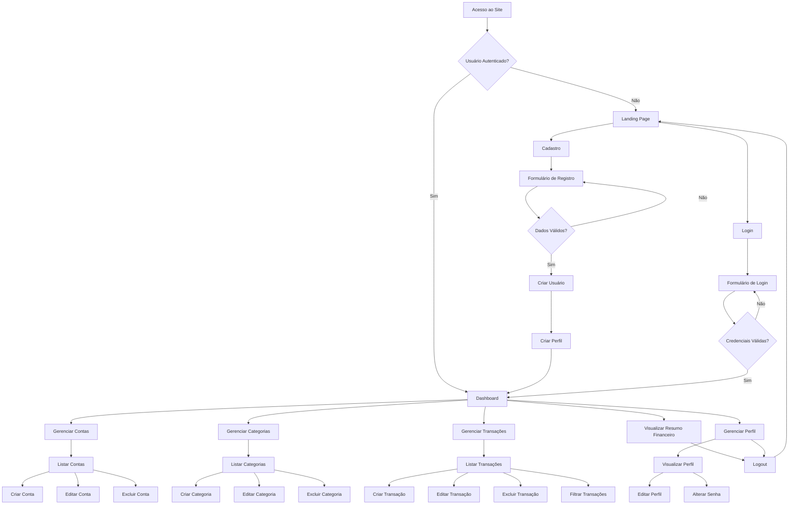
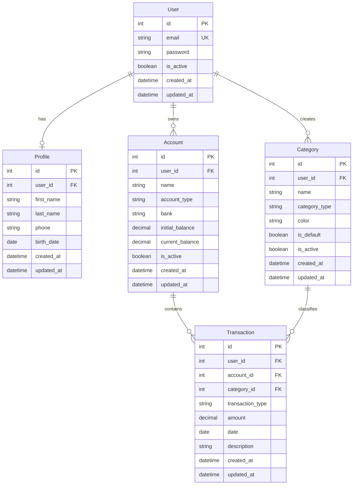
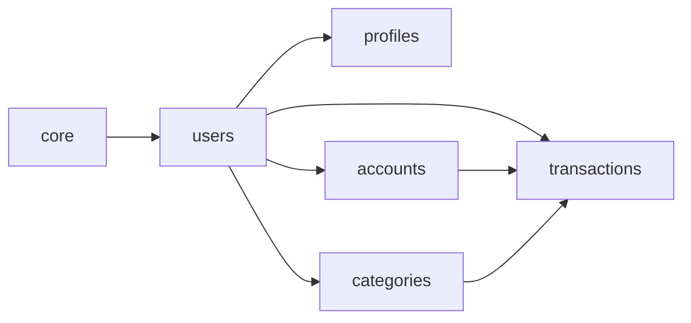

# PRD - Finanpy
## Product Requirement Document

---

## 1. Visão Geral

O **Finanpy** é um sistema de gestão de finanças pessoais desenvolvido em Python/Django, focado em simplicidade e eficiência. O projeto visa fornecer uma solução completa para controle financeiro pessoal através de uma interface web moderna e responsiva, sem complexidade desnecessária (anti-overengineering).

---

## 2. Sobre o Produto

Finanpy é uma aplicação web full-stack que permite aos usuários gerenciar suas finanças pessoais de forma intuitiva. O sistema utiliza Django como framework principal, com templates nativos para o frontend e TailwindCSS para estilização, proporcionando uma experiência visual moderna com tema escuro e gradientes harmônicos.

**Características principais:**
- Sistema de autenticação baseado em email
- Gestão de contas bancárias
- Categorização de transações
- Controle de receitas e despesas
- Dashboard analítico
- Design system consistente

---

## 3. Propósito

Oferecer uma ferramenta simples, eficiente e visualmente atraente para que pessoas possam organizar suas finanças pessoais, acompanhar gastos, gerenciar múltiplas contas bancárias e tomar decisões financeiras mais informadas através de visualização clara de dados.

---

## 4. Público Alvo

- **Primário:** Jovens adultos (25-40 anos) que buscam organizar suas finanças pessoais
- **Secundário:** Profissionais autônomos e freelancers que precisam controlar receitas e despesas
- **Terciário:** Famílias que desejam ter visibilidade sobre o orçamento doméstico

**Personas:**
- **Maria, 28 anos:** Designer freelancer que precisa organizar recebimentos de múltiplos clientes
- **Carlos, 35 anos:** Profissional de TI que quer controlar gastos mensais e economizar
- **Ana, 42 anos:** Mãe de família que gerencia o orçamento doméstico

---

## 5. Objetivos

### Objetivos de Negócio
- Criar MVP funcional em 8 sprints
- Alcançar 100 usuários ativos no primeiro trimestre
- Taxa de retenção de 60% após 30 dias

### Objetivos de Produto
- Interface intuitiva com curva de aprendizado inferior a 5 minutos
- Tempo de resposta inferior a 2 segundos para operações CRUD
- Sistema estável com 99% de uptime

### Objetivos de Usuário
- Visualizar saldo consolidado de todas as contas em tempo real
- Categorizar transações de forma rápida
- Identificar padrões de gastos mensais
- Exportar relatórios financeiros

---

## 6. Requisitos Funcionais

### 6.1. Autenticação e Autorização
- **RF01:** Sistema deve permitir cadastro de novos usuários com email e senha
- **RF02:** Login deve ser realizado através de email (não username)
- **RF03:** Sistema deve validar formato de email e força de senha
- **RF04:** Usuário deve poder recuperar senha através de email
- **RF05:** Sistema deve manter sessão do usuário logado

### 6.2. Gestão de Perfil
- **RF06:** Usuário deve poder visualizar e editar dados do perfil
- **RF07:** Sistema deve armazenar informações complementares do usuário
- **RF08:** Usuário deve poder alterar senha

### 6.3. Gestão de Contas Bancárias
- **RF09:** Usuário deve poder cadastrar múltiplas contas bancárias
- **RF10:** Cada conta deve ter: nome, tipo, saldo inicial, banco
- **RF11:** Sistema deve calcular saldo atual baseado em transações
- **RF12:** Usuário deve poder editar e excluir contas
- **RF13:** Sistema deve listar todas as contas do usuário

### 6.4. Gestão de Categorias
- **RF14:** Sistema deve fornecer categorias padrão (Alimentação, Transporte, etc.)
- **RF15:** Usuário deve poder criar categorias personalizadas
- **RF16:** Categorias devem ter tipo: receita ou despesa
- **RF17:** Usuário deve poder editar e excluir categorias personalizadas
- **RF18:** Sistema deve impedir exclusão de categorias em uso

### 6.5. Gestão de Transações
- **RF19:** Usuário deve poder registrar transações (receitas/despesas)
- **RF20:** Transação deve ter: valor, data, categoria, conta, descrição
- **RF21:** Usuário deve poder editar transações
- **RF22:** Usuário deve poder excluir transações
- **RF23:** Sistema deve listar transações com filtros (data, categoria, tipo)
- **RF24:** Sistema deve atualizar saldo da conta ao criar/editar/excluir transação

### 6.6. Dashboard
- **RF25:** Dashboard deve exibir saldo total de todas as contas
- **RF26:** Dashboard deve exibir resumo mensal (receitas vs despesas)
- **RF27:** Dashboard deve exibir gráfico de categorias mais utilizadas
- **RF28:** Dashboard deve listar últimas transações
- **RF29:** Dashboard deve permitir acesso rápido às funcionalidades principais

### 6.7. Site Público
- **RF30:** Site deve ter landing page com informações do produto
- **RF31:** Site deve ter botões de "Cadastre-se" e "Login"
- **RF32:** Site deve ser responsivo e visualmente atrativo

### 6.8. Flowchart de UX



---

## 7. Requisitos Não-Funcionais

### 7.1. Performance
- **RNF01:** Páginas devem carregar em menos de 2 segundos
- **RNF02:** Operações CRUD devem responder em menos de 1 segundo
- **RNF03:** Dashboard deve renderizar em menos de 3 segundos

### 7.2. Usabilidade
- **RNF04:** Interface deve ser intuitiva e autoexplicativa
- **RNF05:** Sistema deve ser responsivo (mobile, tablet, desktop)
- **RNF06:** Feedback visual para todas as ações do usuário
- **RNF07:** Mensagens de erro devem ser claras e em português

### 7.3. Segurança
- **RNF08:** Senhas devem ser armazenadas com hash seguro
- **RNF09:** Sessões devem expirar após inatividade
- **RNF10:** Validação de dados em frontend e backend
- **RNF11:** Proteção CSRF em todos os formulários

### 7.4. Manutenibilidade
- **RNF12:** Código deve seguir PEP 8
- **RNF13:** Código deve usar aspas simples
- **RNF14:** Separação de responsabilidades por apps Django
- **RNF15:** Código em inglês, interface em português

### 7.5. Escalabilidade
- **RNF16:** Arquitetura deve suportar até 1000 usuários simultâneos
- **RNF17:** Banco de dados deve suportar milhões de transações

### 7.6. Compatibilidade
- **RNF18:** Suporte aos navegadores Chrome, Firefox, Safari, Edge (últimas 2 versões)
- **RNF19:** Compatível com dispositivos iOS e Android

---

## 8. Arquitetura Técnica

### 8.1. Stack Tecnológica

**Backend:**
- Python 3.11+
- Django 5.0+
- SQLite3 (banco de dados)

**Frontend:**
- Django Template Language
- TailwindCSS 3.x
- JavaScript vanilla (minimal)

**Infraestrutura:**
- Servidor de desenvolvimento Django
- Sem containerização (Docker em sprints finais)

### 8.2. Estrutura de Dados



### 8.3. Diagrama de Apps



---

## 9. Design System

### 9.1. Paleta de Cores

**Cores Primárias:**
```css
primary-600: #7C3AED (Roxo vibrante)
primary-700: #6D28D9
primary-800: #5B21B6

secondary-500: #06B6D4 (Ciano)
secondary-600: #0891B2
secondary-700: #0E7490

accent-500: #F59E0B (Âmbar)
accent-600: #D97706
```

**Cores de Fundo (Dark Theme):**
```css
bg-primary: #0F172A (Slate 900)
bg-secondary: #1E293B (Slate 800)
bg-tertiary: #334155 (Slate 700)
```

**Cores de Texto:**
```css
text-primary: #F1F5F9 (Slate 100)
text-secondary: #CBD5E1 (Slate 300)
text-muted: #94A3B8 (Slate 400)
```

**Cores de Status:**
```css
success: #10B981 (Green 500)
error: #EF4444 (Red 500)
warning: #F59E0B (Amber 500)
info: #3B82F6 (Blue 500)
```

**Gradientes:**
```css
gradient-primary: from-primary-600 to-secondary-600
gradient-accent: from-accent-500 to-primary-600
gradient-dark: from-slate-900 to-slate-800
```

### 9.2. Tipografia

**Fontes:**
- **Principal:** Inter (Google Fonts)
- **Monospace:** JetBrains Mono (para valores monetários)

**Escalas de Texto:**
```css
text-xs: 0.75rem (12px)
text-sm: 0.875rem (14px)
text-base: 1rem (16px)
text-lg: 1.125rem (18px)
text-xl: 1.25rem (20px)
text-2xl: 1.5rem (24px)
text-3xl: 1.875rem (30px)
text-4xl: 2.25rem (36px)
```

### 9.3. Componentes

**Botões:**
```html
<!-- Botão Primário -->
<button class="px-6 py-3 bg-gradient-to-r from-primary-600 to-primary-700 hover:from-primary-700 hover:to-primary-800 text-white font-medium rounded-lg shadow-lg hover:shadow-xl transition-all duration-200">
    Texto do Botão
</button>

<!-- Botão Secundário -->
<button class="px-6 py-3 bg-slate-700 hover:bg-slate-600 text-slate-100 font-medium rounded-lg border border-slate-600 transition-all duration-200">
    Texto do Botão
</button>

<!-- Botão Outline -->
<button class="px-6 py-3 border-2 border-primary-600 text-primary-400 hover:bg-primary-600 hover:text-white font-medium rounded-lg transition-all duration-200">
    Texto do Botão
</button>
```

**Inputs e Forms:**
```html
<!-- Input Text -->
<div class="mb-4">
    <label class="block text-slate-300 text-sm font-medium mb-2">
        Label do Campo
    </label>
    <input type="text" 
           class="w-full px-4 py-3 bg-slate-800 border border-slate-700 rounded-lg text-slate-100 placeholder-slate-500 focus:outline-none focus:ring-2 focus:ring-primary-600 focus:border-transparent transition-all duration-200"
           placeholder="Digite aqui...">
</div>

<!-- Select -->
<select class="w-full px-4 py-3 bg-slate-800 border border-slate-700 rounded-lg text-slate-100 focus:outline-none focus:ring-2 focus:ring-primary-600 focus:border-transparent">
    <option>Opção 1</option>
</select>

<!-- Textarea -->
<textarea class="w-full px-4 py-3 bg-slate-800 border border-slate-700 rounded-lg text-slate-100 placeholder-slate-500 focus:outline-none focus:ring-2 focus:ring-primary-600 focus:border-transparent resize-none" rows="4"></textarea>
```

**Cards:**
```html
<div class="bg-slate-800 rounded-xl shadow-lg border border-slate-700 p-6 hover:border-primary-600 transition-all duration-200">
    <h3 class="text-xl font-bold text-slate-100 mb-2">Título do Card</h3>
    <p class="text-slate-300">Conteúdo do card...</p>
</div>

<!-- Card com Gradiente -->
<div class="bg-gradient-to-br from-slate-800 to-slate-900 rounded-xl shadow-xl border border-slate-700 p-6">
    <div class="flex items-center justify-between">
        <div>
            <p class="text-slate-400 text-sm">Label</p>
            <p class="text-3xl font-bold text-slate-100 mt-1">R$ 1.234,56</p>
        </div>
        <div class="p-3 bg-primary-600 rounded-lg">
            <!-- Icon -->
        </div>
    </div>
</div>
```

**Tabelas:**
```html
<div class="overflow-x-auto bg-slate-800 rounded-xl border border-slate-700">
    <table class="w-full">
        <thead class="bg-slate-900 border-b border-slate-700">
            <tr>
                <th class="px-6 py-4 text-left text-xs font-medium text-slate-300 uppercase tracking-wider">Coluna 1</th>
                <th class="px-6 py-4 text-left text-xs font-medium text-slate-300 uppercase tracking-wider">Coluna 2</th>
            </tr>
        </thead>
        <tbody class="divide-y divide-slate-700">
            <tr class="hover:bg-slate-700 transition-colors">
                <td class="px-6 py-4 text-sm text-slate-100">Dado 1</td>
                <td class="px-6 py-4 text-sm text-slate-100">Dado 2</td>
            </tr>
        </tbody>
    </table>
</div>
```

**Alertas:**
```html
<!-- Success -->
<div class="bg-green-900/30 border border-green-700 rounded-lg p-4 flex items-center">
    <div class="text-green-400 mr-3">✓</div>
    <p class="text-green-100">Mensagem de sucesso</p>
</div>

<!-- Error -->
<div class="bg-red-900/30 border border-red-700 rounded-lg p-4 flex items-center">
    <div class="text-red-400 mr-3">✗</div>
    <p class="text-red-100">Mensagem de erro</p>
</div>
```

**Navegação:**
```html
<!-- Navbar -->
<nav class="bg-slate-900 border-b border-slate-800">
    <div class="container mx-auto px-4">
        <div class="flex items-center justify-between h-16">
            <div class="flex items-center">
                <span class="text-2xl font-bold bg-gradient-to-r from-primary-400 to-secondary-400 bg-clip-text text-transparent">
                    Finanpy
                </span>
            </div>
            <div class="flex items-center space-x-4">
                <a href="#" class="text-slate-300 hover:text-primary-400 px-3 py-2 rounded-lg transition-colors">
                    Link
                </a>
            </div>
        </div>
    </div>
</nav>

<!-- Sidebar -->
<aside class="w-64 bg-slate-900 border-r border-slate-800 h-screen fixed left-0 top-0">
    <div class="p-6">
        <h2 class="text-xl font-bold text-slate-100">Menu</h2>
        <nav class="mt-6 space-y-2">
            <a href="#" class="flex items-center px-4 py-3 text-slate-300 hover:bg-slate-800 hover:text-primary-400 rounded-lg transition-all">
                Item 1
            </a>
        </nav>
    </div>
</aside>
```

### 9.4. Grids e Layout

**Container:**
```html
<div class="container mx-auto px-4 sm:px-6 lg:px-8">
    <!-- Conteúdo -->
</div>
```

**Grid Responsivo:**
```html
<div class="grid grid-cols-1 md:grid-cols-2 lg:grid-cols-3 gap-6">
    <!-- Cards -->
</div>
```

**Dashboard Layout:**
```html
<div class="min-h-screen bg-slate-900">
    <!-- Navbar -->
    <div class="flex">
        <!-- Sidebar -->
        <main class="flex-1 p-6 ml-64">
            <!-- Conteúdo Principal -->
        </main>
    </div>
</div>
```

### 9.5. Espaçamentos e Sombras

**Espaçamentos:**
- Pequeno: p-2, p-3, p-4 (8px, 12px, 16px)
- Médio: p-6, p-8 (24px, 32px)
- Grande: p-10, p-12 (40px, 48px)

**Sombras:**
```css
shadow-sm: pequena
shadow-md: média
shadow-lg: grande
shadow-xl: extra grande
shadow-2xl: muito grande
```

---

## 10. User Stories

### Épico 1: Autenticação e Perfil

**US01 - Cadastro de Usuário**
- **Como** visitante
- **Quero** criar uma conta no sistema
- **Para** começar a gerenciar minhas finanças

**Critérios de Aceite:**
- [ ] Formulário deve solicitar: email, senha, confirmação de senha
- [ ] Email deve ser validado (formato correto)
- [ ] Senha deve ter mínimo 8 caracteres
- [ ] Sistema deve exibir mensagem de erro para emails já cadastrados
- [ ] Após cadastro, usuário deve ser redirecionado para dashboard
- [ ] Perfil básico deve ser criado automaticamente

**US02 - Login no Sistema**
- **Como** usuário cadastrado
- **Quero** fazer login com meu email
- **Para** acessar minhas informações financeiras

**Critérios de Aceite:**
- [ ] Login deve usar email (não username)
- [ ] Sistema deve validar credenciais
- [ ] Mensagem de erro clara para credenciais inválidas
- [ ] Após login, usuário deve ser redirecionado para dashboard
- [ ] Sessão deve ser mantida

**US03 - Gestão de Perfil**
- **Como** usuário logado
- **Quero** visualizar e editar meus dados pessoais
- **Para** manter minhas informações atualizadas

**Critérios de Aceite:**
- [ ] Usuário pode visualizar: nome, email, telefone, data de nascimento
- [ ] Usuário pode editar dados pessoais
- [ ] Sistema deve validar dados antes de salvar
- [ ] Mensagem de sucesso após atualização
- [ ] Opção de alterar senha disponível

### Épico 2: Gestão de Contas Bancárias

**US04 - Cadastrar Conta Bancária**
- **Como** usuário logado
- **Quero** cadastrar minhas contas bancárias
- **Para** organizar meus recursos financeiros

**Critérios de Aceite:**
- [ ] Formulário deve solicitar: nome, tipo, banco, saldo inicial
- [ ] Tipos disponíveis: Conta Corrente, Poupança, Carteira, Investimentos
- [ ] Saldo inicial pode ser positivo ou negativo
- [ ] Conta criada deve aparecer na listagem
- [ ] Dashboard deve refletir nova conta

**US05 - Listar Contas**
- **Como** usuário logado
- **Quero** visualizar todas minhas contas
- **Para** ter visão geral dos meus recursos

**Critérios de Aceite:**
- [ ] Listagem deve mostrar: nome, banco, tipo, saldo atual
- [ ] Contas devem ser ordenadas por nome
- [ ] Deve mostrar saldo total de todas as contas
- [ ] Opções de editar e excluir visíveis
- [ ] Layout responsivo

**US06 - Editar Conta**
- **Como** usuário logado
- **Quero** editar dados de uma conta
- **Para** corrigir informações ou atualizá-las

**Critérios de Aceite:**
- [ ] Formulário deve vir preenchido com dados atuais
- [ ] Todos os campos devem ser editáveis exceto saldo atual
- [ ] Validações devem ser aplicadas
- [ ] Mensagem de sucesso após salvar
- [ ] Listagem deve refletir alterações

**US07 - Excluir Conta**
- **Como** usuário logado
- **Quero** excluir uma conta
- **Para** remover contas que não uso mais

**Critérios de Aceite:**
- [ ] Sistema deve solicitar confirmação antes de excluir
- [ ] Exclusão deve ser lógica (is_active = False)
- [ ] Transações relacionadas devem ser mantidas
- [ ] Mensagem de sucesso após exclusão
- [ ] Conta não deve mais aparecer na listagem

### Épico 3: Gestão de Categorias

**US08 - Visualizar Categorias**
- **Como** usuário logado
- **Quero** visualizar categorias disponíveis
- **Para** conhecer as opções de classificação

**Critérios de Aceite:**
- [ ] Sistema deve ter categorias padrão pré-cadastradas
- [ ] Categorias devem ser separadas por tipo (receita/despesa)
- [ ] Cada categoria deve ter cor identificadora
- [ ] Usuário pode ver categorias padrão e personalizadas

**US09 - Criar Categoria Personalizada**
- **Como** usuário logado
- **Quero** criar categorias customizadas
- **Para** classificar transações de forma personalizada

**Critérios de Aceite:**
- [ ] Formulário deve solicitar: nome, tipo, cor
- [ ] Nome deve ser único por usuário
- [ ] Tipos disponíveis: Receita, Despesa
- [ ] Seletor de cores deve estar disponível
- [ ] Categoria criada deve aparecer na listagem

**US10 - Editar Categoria**
- **Como** usuário logado
- **Quero** editar minhas categorias personalizadas
- **Para** ajustar nome ou cor

**Critérios de Aceite:**
- [ ] Apenas categorias personalizadas podem ser editadas
- [ ] Formulário deve vir preenchido
- [ ] Validações devem ser aplicadas
- [ ] Alterações não afetam transações existentes

**US11 - Excluir Categoria**
- **Como** usuário logado
- **Quero** excluir categorias que não uso
- **Para** manter listagem organizada

**Critérios de Aceite:**
- [ ] Apenas categorias sem transações podem ser excluídas
- [ ] Sistema deve verificar uso antes de permitir exclusão
- [ ] Mensagem clara caso categoria esteja em uso
- [ ] Confirmação obrigatória

### Épico 4: Gestão de Transações

**US12 - Registrar Transação**
- **Como** usuário logado
- **Quero** registrar receitas e despesas
- **Para** controlar meu fluxo de caixa

**Critérios de Aceite:**
- [ ] Formulário deve solicitar: tipo, valor, data, categoria, conta, descrição
- [ ] Tipos: Receita, Despesa
- [ ] Valor deve aceitar decimais (formato brasileiro)
- [ ] Data não pode ser futura
- [ ] Apenas categorias do tipo correto devem aparecer
- [ ] Saldo da conta deve ser atualizado automaticamente
- [ ] Descrição é opcional

**US13 - Listar Transações**
- **Como** usuário logado
- **Quero** visualizar minhas transações
- **Para** acompanhar meu histórico financeiro

**Critérios de Aceite:**
- [ ] Listagem deve mostrar: data, descrição, categoria, conta, valor
- [ ] Transações ordenadas por data (mais recente primeiro)
- [ ] Receitas e despesas devem ter cores diferentes
- [ ] Paginação disponível
- [ ] Opções de editar e excluir visíveis

**US14 - Filtrar Transações**
- **Como** usuário logado
- **Quero** filtrar transações por período, categoria ou tipo
- **Para** encontrar informações específicas

**Critérios de Aceite:**
- [ ] Filtros disponíveis: data inicial, data final, categoria, tipo, conta
- [ ] Filtros devem funcionar em conjunto
- [ ] Botão para limpar filtros
- [ ] Resultado deve atualizar automaticamente
- [ ] Contador de registros encontrados

**US15 - Editar Transação**
- **Como** usuário logado
- **Quero** editar uma transação
- **Para** corrigir erros ou atualizar informações

**Critérios de Aceite:**
- [ ] Formulário deve vir preenchido com dados atuais
- [ ] Todos os campos devem ser editáveis
- [ ] Saldo da conta deve ser recalculado
- [ ] Validações devem ser aplicadas
- [ ] Mensagem de sucesso após salvar

**US16 - Excluir Transação**
- **Como** usuário logado
- **Quero** excluir uma transação
- **Para** remover registros incorretos

**Critérios de Aceite:**
- [ ] Sistema deve solicitar confirmação
- [ ] Saldo da conta deve ser ajustado
- [ ] Mensagem de sucesso após exclusão
- [ ] Transação não deve mais aparecer na listagem

### Épico 5: Dashboard e Visualizações

**US17 - Visualizar Dashboard**
- **Como** usuário logado
- **Quero** ver resumo das minhas finanças
- **Para** ter visão rápida da minha situação financeira

**Critérios de Aceite:**
- [ ] Dashboard deve mostrar saldo total consolidado
- [ ] Resumo mensal: total de receitas e despesas
- [ ] Gráfico de distribuição por categorias
- [ ] Lista das últimas 5 transações
- [ ] Cards com informações destacadas
- [ ] Design responsivo com gradientes

**US18 - Acompanhar Evolução**
- **Como** usuário logado
- **Quero** ver evolução do saldo ao longo do tempo
- **Para** identificar tendências

**Critérios de Aceite:**
- [ ] Gráfico de linha mostrando evolução mensal
- [ ] Período selecionável (3, 6, 12 meses)
- [ ] Diferenciação visual entre receitas e despesas
- [ ] Valores formatados em reais

### Épico 6: Site Público

**US19 - Acessar Landing Page**
- **Como** visitante
- **Quero** conhecer o produto
- **Para** decidir se vou me cadastrar

**Critérios de Aceite:**
- [ ] Página deve apresentar benefícios do sistema
- [ ] Design atrativo com gradientes e tema escuro
- [ ] Botões de "Cadastre-se" e "Login" visíveis
- [ ] Layout responsivo
- [ ] Carregamento rápido

---

## 11. Métricas de Sucesso

### 11.1. KPIs de Produto

**Adoção:**
- Taxa de conversão de visitantes para cadastros: >15%
- Número de usuários ativos mensais (MAU): 100+ no primeiro trimestre
- Crescimento mensal de usuários: >20%

**Engajamento:**
- Frequência de uso: 3+ sessões por semana
- Tempo médio por sessão: 5-10 minutos
- Taxa de retenção D7: >40%
- Taxa de retenção D30: >60%

**Funcionalidades:**
- Transações cadastradas por usuário/mês: >20
- Contas cadastradas por usuário: 2-4
- Categorias personalizadas criadas: >2 por usuário

### 11.2. KPIs de Qualidade

**Performance:**
- Tempo de carregamento de páginas: <2s
- Taxa de erro: <1%
- Disponibilidade: >99%

**Usabilidade:**
- Taxa de conclusão de tarefas: >90%
- Tempo para cadastrar primeira transação: <2 minutos
- Taxa de abandono no cadastro: <20%

### 11.3. KPIs de Negócio

**Crescimento:**
- Custo de aquisição por usuário (CAC): Meta definir
- Lifetime Value (LTV): Meta definir
- Churn rate: <10% ao mês

---

## 12. Riscos e Mitigações

### Risco 1: Complexidade de Implementação
**Probabilidade:** Média | **Impacto:** Alto
- **Descrição:** Projeto pode ficar mais complexo que o planejado
- **Mitigação:** Seguir princípio anti-overengineering, revisar escopo constantemente

### Risco 2: Performance com Volume de Dados
**Probabilidade:** Média | **Impacto:** Médio
- **Descrição:** SQLite pode ter limitações com muitas transações
- **Mitigação:** Implementar paginação, índices adequados, considerar migração para PostgreSQL futuramente

### Risco 3: Segurança de Dados
**Probabilidade:** Baixa | **Impacto:** Alto
- **Descrição:** Exposição de dados financeiros sensíveis
- **Mitigação:** Seguir boas práticas Django, validações robustas, HTTPS obrigatório em produção

### Risco 4: Experiência de Usuário
**Probabilidade:** Média | **Impacto:** Médio
- **Descrição:** Interface pode não ser intuitiva o suficiente
- **Mitigação:** Testes com usuários reais, iterações no design, feedback contínuo

### Risco 5: Prazo de Entrega
**Probabilidade:** Média | **Impacto:** Médio
- **Descrição:** Sprints podem atrasar por imprevistos
- **Mitigação:** Buffer de tempo em cada sprint, priorização clara de funcionalidades

### Risco 6: Adoção de Usuários
**Probabilidade:** Média | **Impacto:** Alto
- **Descrição:** Usuários podem não adotar o sistema
- **Mitigação:** Landing page atrativa, onboarding simplificado, valor claro desde primeiro uso

---


## 15. Conclusão

Este PRD define um roadmap claro e detalhado para o desenvolvimento do **Finanpy**, um sistema de gestão de finanças pessoais moderno e eficiente. O projeto está estruturado em 8 sprints principais que cobrem desde a configuração inicial até o refinamento final do MVP.

### Próximos Passos
1. Revisar e aprovar este PRD
2. Iniciar Sprint 0 (Setup)
3. Realizar daily standups durante cada sprint
4. Revisar progresso ao final de cada sprint
5. Ajustar escopo conforme necessário

### Princípios a Seguir
- **Simplicidade:** Evitar over-engineering
- **Qualidade:** Código limpo seguindo PEP 8
- **Consistência:** Design system bem definido
- **Segurança:** Boas práticas em todos os níveis
- **UX:** Foco na experiência do usuário

**Data de Criação:** Janeiro 2026  
**Versão:** 1.0  
**Status:** Aprovado para Implementação
