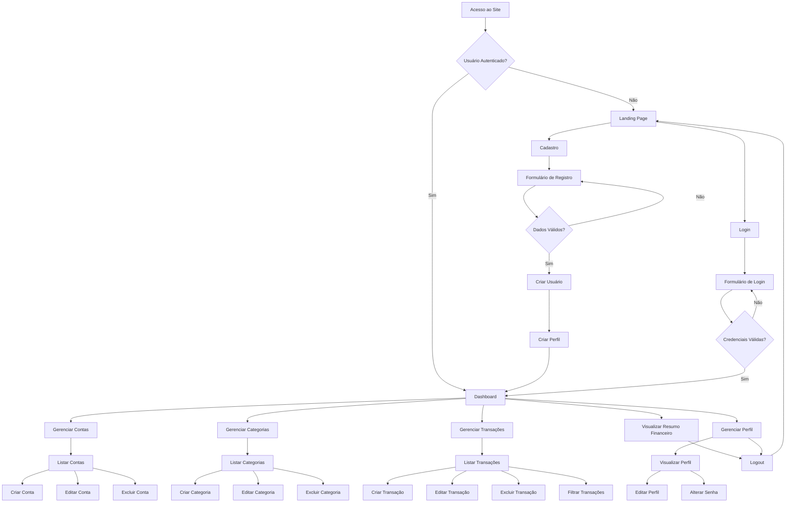
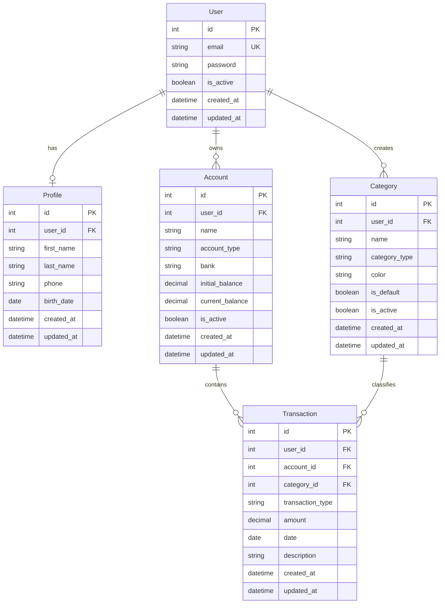
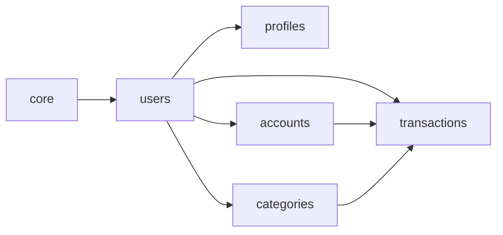

# PRD - Finanpy
## Product Requirement Document

---

## 1. Visão Geral

O **Finanpy** é um sistema de gestão de finanças pessoais desenvolvido em Python/Django, focado em simplicidade e eficiência. O projeto visa fornecer uma solução completa para controle financeiro pessoal através de uma interface web moderna e responsiva, sem complexidade desnecessária (anti-overengineering).

---

## 2. Sobre o Produto

Finanpy é uma aplicação web full-stack que permite aos usuários gerenciar suas finanças pessoais de forma intuitiva. O sistema utiliza Django como framework principal, com templates nativos para o frontend e TailwindCSS para estilização, proporcionando uma experiência visual moderna com tema escuro e gradientes harmônicos.

**Características principais:**
- Sistema de autenticação baseado em email
- Gestão de contas bancárias
- Categorização de transações
- Controle de receitas e despesas
- Dashboard analítico
- Design system consistente

---

## 3. Propósito

Oferecer uma ferramenta simples, eficiente e visualmente atraente para que pessoas possam organizar suas finanças pessoais, acompanhar gastos, gerenciar múltiplas contas bancárias e tomar decisões financeiras mais informadas através de visualização clara de dados.

---

## 4. Público Alvo

- **Primário:** Jovens adultos (25-40 anos) que buscam organizar suas finanças pessoais
- **Secundário:** Profissionais autônomos e freelancers que precisam controlar receitas e despesas
- **Terciário:** Famílias que desejam ter visibilidade sobre o orçamento doméstico

**Personas:**
- **Maria, 28 anos:** Designer freelancer que precisa organizar recebimentos de múltiplos clientes
- **Carlos, 35 anos:** Profissional de TI que quer controlar gastos mensais e economizar
- **Ana, 42 anos:** Mãe de família que gerencia o orçamento doméstico

---

## 5. Objetivos

### Objetivos de Negócio
- Criar MVP funcional em 8 sprints
- Alcançar 100 usuários ativos no primeiro trimestre
- Taxa de retenção de 60% após 30 dias

### Objetivos de Produto
- Interface intuitiva com curva de aprendizado inferior a 5 minutos
- Tempo de resposta inferior a 2 segundos para operações CRUD
- Sistema estável com 99% de uptime

### Objetivos de Usuário
- Visualizar saldo consolidado de todas as contas em tempo real
- Categorizar transações de forma rápida
- Identificar padrões de gastos mensais
- Exportar relatórios financeiros

---

## 6. Requisitos Funcionais

### 6.1. Autenticação e Autorização
- **RF01:** Sistema deve permitir cadastro de novos usuários com email e senha
- **RF02:** Login deve ser realizado através de email (não username)
- **RF03:** Sistema deve validar formato de email e força de senha
- **RF04:** Usuário deve poder recuperar senha através de email
- **RF05:** Sistema deve manter sessão do usuário logado

### 6.2. Gestão de Perfil
- **RF06:** Usuário deve poder visualizar e editar dados do perfil
- **RF07:** Sistema deve armazenar informações complementares do usuário
- **RF08:** Usuário deve poder alterar senha

### 6.3. Gestão de Contas Bancárias
- **RF09:** Usuário deve poder cadastrar múltiplas contas bancárias
- **RF10:** Cada conta deve ter: nome, tipo, saldo inicial, banco
- **RF11:** Sistema deve calcular saldo atual baseado em transações
- **RF12:** Usuário deve poder editar e excluir contas
- **RF13:** Sistema deve listar todas as contas do usuário

### 6.4. Gestão de Categorias
- **RF14:** Sistema deve fornecer categorias padrão (Alimentação, Transporte, etc.)
- **RF15:** Usuário deve poder criar categorias personalizadas
- **RF16:** Categorias devem ter tipo: receita ou despesa
- **RF17:** Usuário deve poder editar e excluir categorias personalizadas
- **RF18:** Sistema deve impedir exclusão de categorias em uso

### 6.5. Gestão de Transações
- **RF19:** Usuário deve poder registrar transações (receitas/despesas)
- **RF20:** Transação deve ter: valor, data, categoria, conta, descrição
- **RF21:** Usuário deve poder editar transações
- **RF22:** Usuário deve poder excluir transações
- **RF23:** Sistema deve listar transações com filtros (data, categoria, tipo)
- **RF24:** Sistema deve atualizar saldo da conta ao criar/editar/excluir transação

### 6.6. Dashboard
- **RF25:** Dashboard deve exibir saldo total de todas as contas
- **RF26:** Dashboard deve exibir resumo mensal (receitas vs despesas)
- **RF27:** Dashboard deve exibir gráfico de categorias mais utilizadas
- **RF28:** Dashboard deve listar últimas transações
- **RF29:** Dashboard deve permitir acesso rápido às funcionalidades principais

### 6.7. Site Público
- **RF30:** Site deve ter landing page com informações do produto
- **RF31:** Site deve ter botões de "Cadastre-se" e "Login"
- **RF32:** Site deve ser responsivo e visualmente atrativo

### 6.8. Flowchart de UX



---

## 7. Requisitos Não-Funcionais

### 7.1. Performance
- **RNF01:** Páginas devem carregar em menos de 2 segundos
- **RNF02:** Operações CRUD devem responder em menos de 1 segundo
- **RNF03:** Dashboard deve renderizar em menos de 3 segundos

### 7.2. Usabilidade
- **RNF04:** Interface deve ser intuitiva e autoexplicativa
- **RNF05:** Sistema deve ser responsivo (mobile, tablet, desktop)
- **RNF06:** Feedback visual para todas as ações do usuário
- **RNF07:** Mensagens de erro devem ser claras e em português

### 7.3. Segurança
- **RNF08:** Senhas devem ser armazenadas com hash seguro
- **RNF09:** Sessões devem expirar após inatividade
- **RNF10:** Validação de dados em frontend e backend
- **RNF11:** Proteção CSRF em todos os formulários

### 7.4. Manutenibilidade
- **RNF12:** Código deve seguir PEP 8
- **RNF13:** Código deve usar aspas simples
- **RNF14:** Separação de responsabilidades por apps Django
- **RNF15:** Código em inglês, interface em português

### 7.5. Escalabilidade
- **RNF16:** Arquitetura deve suportar até 1000 usuários simultâneos
- **RNF17:** Banco de dados deve suportar milhões de transações

### 7.6. Compatibilidade
- **RNF18:** Suporte aos navegadores Chrome, Firefox, Safari, Edge (últimas 2 versões)
- **RNF19:** Compatível com dispositivos iOS e Android

---

## 8. Arquitetura Técnica

### 8.1. Stack Tecnológica

**Backend:**
- Python 3.11+
- Django 5.0+
- SQLite3 (banco de dados)

**Frontend:**
- Django Template Language
- TailwindCSS 3.x
- JavaScript vanilla (minimal)

**Infraestrutura:**
- Servidor de desenvolvimento Django
- Sem containerização (Docker em sprints finais)

### 8.2. Estrutura de Dados



### 8.3. Diagrama de Apps



---

## 9. Design System

### 9.1. Paleta de Cores

**Cores Primárias:**
```css
primary-600: #7C3AED (Roxo vibrante)
primary-700: #6D28D9
primary-800: #5B21B6

secondary-500: #06B6D4 (Ciano)
secondary-600: #0891B2
secondary-700: #0E7490

accent-500: #F59E0B (Âmbar)
accent-600: #D97706
```

**Cores de Fundo (Dark Theme):**
```css
bg-primary: #0F172A (Slate 900)
bg-secondary: #1E293B (Slate 800)
bg-tertiary: #334155 (Slate 700)
```

**Cores de Texto:**
```css
text-primary: #F1F5F9 (Slate 100)
text-secondary: #CBD5E1 (Slate 300)
text-muted: #94A3B8 (Slate 400)
```

**Cores de Status:**
```css
success: #10B981 (Green 500)
error: #EF4444 (Red 500)
warning: #F59E0B (Amber 500)
info: #3B82F6 (Blue 500)
```

**Gradientes:**
```css
gradient-primary: from-primary-600 to-secondary-600
gradient-accent: from-accent-500 to-primary-600
gradient-dark: from-slate-900 to-slate-800
```

### 9.2. Tipografia

**Fontes:**
- **Principal:** Inter (Google Fonts)
- **Monospace:** JetBrains Mono (para valores monetários)

**Escalas de Texto:**
```css
text-xs: 0.75rem (12px)
text-sm: 0.875rem (14px)
text-base: 1rem (16px)
text-lg: 1.125rem (18px)
text-xl: 1.25rem (20px)
text-2xl: 1.5rem (24px)
text-3xl: 1.875rem (30px)
text-4xl: 2.25rem (36px)
```

### 9.3. Componentes

**Botões:**
```html
<!-- Botão Primário -->
<button class="px-6 py-3 bg-gradient-to-r from-primary-600 to-primary-700 hover:from-primary-700 hover:to-primary-800 text-white font-medium rounded-lg shadow-lg hover:shadow-xl transition-all duration-200">
    Texto do Botão
</button>

<!-- Botão Secundário -->
<button class="px-6 py-3 bg-slate-700 hover:bg-slate-600 text-slate-100 font-medium rounded-lg border border-slate-600 transition-all duration-200">
    Texto do Botão
</button>

<!-- Botão Outline -->
<button class="px-6 py-3 border-2 border-primary-600 text-primary-400 hover:bg-primary-600 hover:text-white font-medium rounded-lg transition-all duration-200">
    Texto do Botão
</button>
```

**Inputs e Forms:**
```html
<!-- Input Text -->
<div class="mb-4">
    <label class="block text-slate-300 text-sm font-medium mb-2">
        Label do Campo
    </label>
    <input type="text" 
           class="w-full px-4 py-3 bg-slate-800 border border-slate-700 rounded-lg text-slate-100 placeholder-slate-500 focus:outline-none focus:ring-2 focus:ring-primary-600 focus:border-transparent transition-all duration-200"
           placeholder="Digite aqui...">
</div>

<!-- Select -->
<select class="w-full px-4 py-3 bg-slate-800 border border-slate-700 rounded-lg text-slate-100 focus:outline-none focus:ring-2 focus:ring-primary-600 focus:border-transparent">
    <option>Opção 1</option>
</select>

<!-- Textarea -->
<textarea class="w-full px-4 py-3 bg-slate-800 border border-slate-700 rounded-lg text-slate-100 placeholder-slate-500 focus:outline-none focus:ring-2 focus:ring-primary-600 focus:border-transparent resize-none" rows="4"></textarea>
```

**Cards:**
```html
<div class="bg-slate-800 rounded-xl shadow-lg border border-slate-700 p-6 hover:border-primary-600 transition-all duration-200">
    <h3 class="text-xl font-bold text-slate-100 mb-2">Título do Card</h3>
    <p class="text-slate-300">Conteúdo do card...</p>
</div>

<!-- Card com Gradiente -->
<div class="bg-gradient-to-br from-slate-800 to-slate-900 rounded-xl shadow-xl border border-slate-700 p-6">
    <div class="flex items-center justify-between">
        <div>
            <p class="text-slate-400 text-sm">Label</p>
            <p class="text-3xl font-bold text-slate-100 mt-1">R$ 1.234,56</p>
        </div>
        <div class="p-3 bg-primary-600 rounded-lg">
            <!-- Icon -->
        </div>
    </div>
</div>
```

**Tabelas:**
```html
<div class="overflow-x-auto bg-slate-800 rounded-xl border border-slate-700">
    <table class="w-full">
        <thead class="bg-slate-900 border-b border-slate-700">
            <tr>
                <th class="px-6 py-4 text-left text-xs font-medium text-slate-300 uppercase tracking-wider">Coluna 1</th>
                <th class="px-6 py-4 text-left text-xs font-medium text-slate-300 uppercase tracking-wider">Coluna 2</th>
            </tr>
        </thead>
        <tbody class="divide-y divide-slate-700">
            <tr class="hover:bg-slate-700 transition-colors">
                <td class="px-6 py-4 text-sm text-slate-100">Dado 1</td>
                <td class="px-6 py-4 text-sm text-slate-100">Dado 2</td>
            </tr>
        </tbody>
    </table>
</div>
```

**Alertas:**
```html
<!-- Success -->
<div class="bg-green-900/30 border border-green-700 rounded-lg p-4 flex items-center">
    <div class="text-green-400 mr-3">✓</div>
    <p class="text-green-100">Mensagem de sucesso</p>
</div>

<!-- Error -->
<div class="bg-red-900/30 border border-red-700 rounded-lg p-4 flex items-center">
    <div class="text-red-400 mr-3">✗</div>
    <p class="text-red-100">Mensagem de erro</p>
</div>
```

**Navegação:**
```html
<!-- Navbar -->
<nav class="bg-slate-900 border-b border-slate-800">
    <div class="container mx-auto px-4">
        <div class="flex items-center justify-between h-16">
            <div class="flex items-center">
                <span class="text-2xl font-bold bg-gradient-to-r from-primary-400 to-secondary-400 bg-clip-text text-transparent">
                    Finanpy
                </span>
            </div>
            <div class="flex items-center space-x-4">
                <a href="#" class="text-slate-300 hover:text-primary-400 px-3 py-2 rounded-lg transition-colors">
                    Link
                </a>
            </div>
        </div>
    </div>
</nav>

<!-- Sidebar -->
<aside class="w-64 bg-slate-900 border-r border-slate-800 h-screen fixed left-0 top-0">
    <div class="p-6">
        <h2 class="text-xl font-bold text-slate-100">Menu</h2>
        <nav class="mt-6 space-y-2">
            <a href="#" class="flex items-center px-4 py-3 text-slate-300 hover:bg-slate-800 hover:text-primary-400 rounded-lg transition-all">
                Item 1
            </a>
        </nav>
    </div>
</aside>
```

### 9.4. Grids e Layout

**Container:**
```html
<div class="container mx-auto px-4 sm:px-6 lg:px-8">
    <!-- Conteúdo -->
</div>
```

**Grid Responsivo:**
```html
<div class="grid grid-cols-1 md:grid-cols-2 lg:grid-cols-3 gap-6">
    <!-- Cards -->
</div>
```

**Dashboard Layout:**
```html
<div class="min-h-screen bg-slate-900">
    <!-- Navbar -->
    <div class="flex">
        <!-- Sidebar -->
        <main class="flex-1 p-6 ml-64">
            <!-- Conteúdo Principal -->
        </main>
    </div>
</div>
```

### 9.5. Espaçamentos e Sombras

**Espaçamentos:**
- Pequeno: p-2, p-3, p-4 (8px, 12px, 16px)
- Médio: p-6, p-8 (24px, 32px)
- Grande: p-10, p-12 (40px, 48px)

**Sombras:**
```css
shadow-sm: pequena
shadow-md: média
shadow-lg: grande
shadow-xl: extra grande
shadow-2xl: muito grande
```

---

## 10. User Stories

### Épico 1: Autenticação e Perfil

**US01 - Cadastro de Usuário**
- **Como** visitante
- **Quero** criar uma conta no sistema
- **Para** começar a gerenciar minhas finanças

**Critérios de Aceite:**
- [ ] Formulário deve solicitar: email, senha, confirmação de senha
- [ ] Email deve ser validado (formato correto)
- [ ] Senha deve ter mínimo 8 caracteres
- [ ] Sistema deve exibir mensagem de erro para emails já cadastrados
- [ ] Após cadastro, usuário deve ser redirecionado para dashboard
- [ ] Perfil básico deve ser criado automaticamente

**US02 - Login no Sistema**
- **Como** usuário cadastrado
- **Quero** fazer login com meu email
- **Para** acessar minhas informações financeiras

**Critérios de Aceite:**
- [ ] Login deve usar email (não username)
- [ ] Sistema deve validar credenciais
- [ ] Mensagem de erro clara para credenciais inválidas
- [ ] Após login, usuário deve ser redirecionado para dashboard
- [ ] Sessão deve ser mantida

**US03 - Gestão de Perfil**
- **Como** usuário logado
- **Quero** visualizar e editar meus dados pessoais
- **Para** manter minhas informações atualizadas

**Critérios de Aceite:**
- [ ] Usuário pode visualizar: nome, email, telefone, data de nascimento
- [ ] Usuário pode editar dados pessoais
- [ ] Sistema deve validar dados antes de salvar
- [ ] Mensagem de sucesso após atualização
- [ ] Opção de alterar senha disponível

### Épico 2: Gestão de Contas Bancárias

**US04 - Cadastrar Conta Bancária**
- **Como** usuário logado
- **Quero** cadastrar minhas contas bancárias
- **Para** organizar meus recursos financeiros

**Critérios de Aceite:**
- [ ] Formulário deve solicitar: nome, tipo, banco, saldo inicial
- [ ] Tipos disponíveis: Conta Corrente, Poupança, Carteira, Investimentos
- [ ] Saldo inicial pode ser positivo ou negativo
- [ ] Conta criada deve aparecer na listagem
- [ ] Dashboard deve refletir nova conta

**US05 - Listar Contas**
- **Como** usuário logado
- **Quero** visualizar todas minhas contas
- **Para** ter visão geral dos meus recursos

**Critérios de Aceite:**
- [ ] Listagem deve mostrar: nome, banco, tipo, saldo atual
- [ ] Contas devem ser ordenadas por nome
- [ ] Deve mostrar saldo total de todas as contas
- [ ] Opções de editar e excluir visíveis
- [ ] Layout responsivo

**US06 - Editar Conta**
- **Como** usuário logado
- **Quero** editar dados de uma conta
- **Para** corrigir informações ou atualizá-las

**Critérios de Aceite:**
- [ ] Formulário deve vir preenchido com dados atuais
- [ ] Todos os campos devem ser editáveis exceto saldo atual
- [ ] Validações devem ser aplicadas
- [ ] Mensagem de sucesso após salvar
- [ ] Listagem deve refletir alterações

**US07 - Excluir Conta**
- **Como** usuário logado
- **Quero** excluir uma conta
- **Para** remover contas que não uso mais

**Critérios de Aceite:**
- [ ] Sistema deve solicitar confirmação antes de excluir
- [ ] Exclusão deve ser lógica (is_active = False)
- [ ] Transações relacionadas devem ser mantidas
- [ ] Mensagem de sucesso após exclusão
- [ ] Conta não deve mais aparecer na listagem

### Épico 3: Gestão de Categorias

**US08 - Visualizar Categorias**
- **Como** usuário logado
- **Quero** visualizar categorias disponíveis
- **Para** conhecer as opções de classificação

**Critérios de Aceite:**
- [ ] Sistema deve ter categorias padrão pré-cadastradas
- [ ] Categorias devem ser separadas por tipo (receita/despesa)
- [ ] Cada categoria deve ter cor identificadora
- [ ] Usuário pode ver categorias padrão e personalizadas

**US09 - Criar Categoria Personalizada**
- **Como** usuário logado
- **Quero** criar categorias customizadas
- **Para** classificar transações de forma personalizada

**Critérios de Aceite:**
- [ ] Formulário deve solicitar: nome, tipo, cor
- [ ] Nome deve ser único por usuário
- [ ] Tipos disponíveis: Receita, Despesa
- [ ] Seletor de cores deve estar disponível
- [ ] Categoria criada deve aparecer na listagem

**US10 - Editar Categoria**
- **Como** usuário logado
- **Quero** editar minhas categorias personalizadas
- **Para** ajustar nome ou cor

**Critérios de Aceite:**
- [ ] Apenas categorias personalizadas podem ser editadas
- [ ] Formulário deve vir preenchido
- [ ] Validações devem ser aplicadas
- [ ] Alterações não afetam transações existentes

**US11 - Excluir Categoria**
- **Como** usuário logado
- **Quero** excluir categorias que não uso
- **Para** manter listagem organizada

**Critérios de Aceite:**
- [ ] Apenas categorias sem transações podem ser excluídas
- [ ] Sistema deve verificar uso antes de permitir exclusão
- [ ] Mensagem clara caso categoria esteja em uso
- [ ] Confirmação obrigatória

### Épico 4: Gestão de Transações

**US12 - Registrar Transação**
- **Como** usuário logado
- **Quero** registrar receitas e despesas
- **Para** controlar meu fluxo de caixa

**Critérios de Aceite:**
- [ ] Formulário deve solicitar: tipo, valor, data, categoria, conta, descrição
- [ ] Tipos: Receita, Despesa
- [ ] Valor deve aceitar decimais (formato brasileiro)
- [ ] Data não pode ser futura
- [ ] Apenas categorias do tipo correto devem aparecer
- [ ] Saldo da conta deve ser atualizado automaticamente
- [ ] Descrição é opcional

**US13 - Listar Transações**
- **Como** usuário logado
- **Quero** visualizar minhas transações
- **Para** acompanhar meu histórico financeiro

**Critérios de Aceite:**
- [ ] Listagem deve mostrar: data, descrição, categoria, conta, valor
- [ ] Transações ordenadas por data (mais recente primeiro)
- [ ] Receitas e despesas devem ter cores diferentes
- [ ] Paginação disponível
- [ ] Opções de editar e excluir visíveis

**US14 - Filtrar Transações**
- **Como** usuário logado
- **Quero** filtrar transações por período, categoria ou tipo
- **Para** encontrar informações específicas

**Critérios de Aceite:**
- [ ] Filtros disponíveis: data inicial, data final, categoria, tipo, conta
- [ ] Filtros devem funcionar em conjunto
- [ ] Botão para limpar filtros
- [ ] Resultado deve atualizar automaticamente
- [ ] Contador de registros encontrados

**US15 - Editar Transação**
- **Como** usuário logado
- **Quero** editar uma transação
- **Para** corrigir erros ou atualizar informações

**Critérios de Aceite:**
- [ ] Formulário deve vir preenchido com dados atuais
- [ ] Todos os campos devem ser editáveis
- [ ] Saldo da conta deve ser recalculado
- [ ] Validações devem ser aplicadas
- [ ] Mensagem de sucesso após salvar

**US16 - Excluir Transação**
- **Como** usuário logado
- **Quero** excluir uma transação
- **Para** remover registros incorretos

**Critérios de Aceite:**
- [ ] Sistema deve solicitar confirmação
- [ ] Saldo da conta deve ser ajustado
- [ ] Mensagem de sucesso após exclusão
- [ ] Transação não deve mais aparecer na listagem

### Épico 5: Dashboard e Visualizações

**US17 - Visualizar Dashboard**
- **Como** usuário logado
- **Quero** ver resumo das minhas finanças
- **Para** ter visão rápida da minha situação financeira

**Critérios de Aceite:**
- [ ] Dashboard deve mostrar saldo total consolidado
- [ ] Resumo mensal: total de receitas e despesas
- [ ] Gráfico de distribuição por categorias
- [ ] Lista das últimas 5 transações
- [ ] Cards com informações destacadas
- [ ] Design responsivo com gradientes

**US18 - Acompanhar Evolução**
- **Como** usuário logado
- **Quero** ver evolução do saldo ao longo do tempo
- **Para** identificar tendências

**Critérios de Aceite:**
- [ ] Gráfico de linha mostrando evolução mensal
- [ ] Período selecionável (3, 6, 12 meses)
- [ ] Diferenciação visual entre receitas e despesas
- [ ] Valores formatados em reais

### Épico 6: Site Público

**US19 - Acessar Landing Page**
- **Como** visitante
- **Quero** conhecer o produto
- **Para** decidir se vou me cadastrar

**Critérios de Aceite:**
- [ ] Página deve apresentar benefícios do sistema
- [ ] Design atrativo com gradientes e tema escuro
- [ ] Botões de "Cadastre-se" e "Login" visíveis
- [ ] Layout responsivo
- [ ] Carregamento rápido

---

## 11. Métricas de Sucesso

### 11.1. KPIs de Produto

**Adoção:**
- Taxa de conversão de visitantes para cadastros: >15%
- Número de usuários ativos mensais (MAU): 100+ no primeiro trimestre
- Crescimento mensal de usuários: >20%

**Engajamento:**
- Frequência de uso: 3+ sessões por semana
- Tempo médio por sessão: 5-10 minutos
- Taxa de retenção D7: >40%
- Taxa de retenção D30: >60%

**Funcionalidades:**
- Transações cadastradas por usuário/mês: >20
- Contas cadastradas por usuário: 2-4
- Categorias personalizadas criadas: >2 por usuário

### 11.2. KPIs de Qualidade

**Performance:**
- Tempo de carregamento de páginas: <2s
- Taxa de erro: <1%
- Disponibilidade: >99%

**Usabilidade:**
- Taxa de conclusão de tarefas: >90%
- Tempo para cadastrar primeira transação: <2 minutos
- Taxa de abandono no cadastro: <20%

### 11.3. KPIs de Negócio

**Crescimento:**
- Custo de aquisição por usuário (CAC): Meta definir
- Lifetime Value (LTV): Meta definir
- Churn rate: <10% ao mês

---

## 12. Riscos e Mitigações

### Risco 1: Complexidade de Implementação
**Probabilidade:** Média | **Impacto:** Alto
- **Descrição:** Projeto pode ficar mais complexo que o planejado
- **Mitigação:** Seguir princípio anti-overengineering, revisar escopo constantemente

### Risco 2: Performance com Volume de Dados
**Probabilidade:** Média | **Impacto:** Médio
- **Descrição:** SQLite pode ter limitações com muitas transações
- **Mitigação:** Implementar paginação, índices adequados, considerar migração para PostgreSQL futuramente

### Risco 3: Segurança de Dados
**Probabilidade:** Baixa | **Impacto:** Alto
- **Descrição:** Exposição de dados financeiros sensíveis
- **Mitigação:** Seguir boas práticas Django, validações robustas, HTTPS obrigatório em produção

### Risco 4: Experiência de Usuário
**Probabilidade:** Média | **Impacto:** Médio
- **Descrição:** Interface pode não ser intuitiva o suficiente
- **Mitigação:** Testes com usuários reais, iterações no design, feedback contínuo

### Risco 5: Prazo de Entrega
**Probabilidade:** Média | **Impacto:** Médio
- **Descrição:** Sprints podem atrasar por imprevistos
- **Mitigação:** Buffer de tempo em cada sprint, priorização clara de funcionalidades

### Risco 6: Adoção de Usuários
**Probabilidade:** Média | **Impacto:** Alto
- **Descrição:** Usuários podem não adotar o sistema
- **Mitigação:** Landing page atrativa, onboarding simplificado, valor claro desde primeiro uso

---

## 13. Lista de Tarefas

### Sprint 0: Setup e Configuração (1 semana)

#### Tarefa 0.1: Configuração Inicial do Projeto
- [X] **0.1.1** - Criar ambiente virtual Python
  - Instalar Python 3.11+
  - Criar venv: `python -m venv venv`
  - Ativar ambiente virtual
  - Documentar comandos no README
  
- [X] **0.1.2** - Instalar Django e dependências
  - Instalar Django 5.0+: `pip install django`
  - Instalar Pillow (se necessário para imagens)
  - Gerar requirements.txt: `pip freeze > requirements.txt`
  
- [X] **0.1.3** - Criar projeto Django
  - Executar: `django-admin startproject core .`
  - Verificar estrutura criada
  - Testar servidor: `python manage.py runserver`
  
- [ ] **0.1.4** - Configurar settings.py
  - Configurar LANGUAGE_CODE = 'pt-br'
  - Configurar TIME_ZONE = 'America/Sao_Paulo'
  - Configurar STATIC_URL e STATIC_ROOT
  - Configurar MEDIA_URL e MEDIA_ROOT
  - Adicionar configurações de segurança básicas

#### Tarefa 0.2: Criação das Apps Django
- [X] **0.2.1** - Criar app users
  - Executar: `python manage.py startapp users`
  - Adicionar em INSTALLED_APPS
  - Criar arquivo urls.py dentro da app
  
- [X] **0.2.2** - Criar app profiles
  - Executar: `python manage.py startapp profiles`
  - Adicionar em INSTALLED_APPS
  - Criar arquivo urls.py dentro da app
  
- [X] **0.2.3** - Criar app accounts
  - Executar: `python manage.py startapp accounts`
  - Adicionar em INSTALLED_APPS
  - Criar arquivo urls.py dentro da app
  
- [X] **0.2.4** - Criar app categories
  - Executar: `python manage.py startapp categories`
  - Adicionar em INSTALLED_APPS
  - Criar arquivo urls.py dentro da app
  
- [X] **0.2.5** - Criar app transactions
  - Executar: `python manage.py startapp transactions`
  - Adicionar em INSTALLED_APPS
  - Criar arquivo urls.py dentro da app

#### Tarefa 0.3: Configuração do TailwindCSS
- [ ] **0.3.1** - Instalar Node.js e npm
  - Verificar instalação: `node --version`
  - Verificar npm: `npm --version`
  
- [ ] **0.3.2** - Configurar TailwindCSS via CDN (temporário)
  - Criar arquivo base.html
  - Adicionar CDN do Tailwind no <head>
  - Testar classes básicas
  
- [ ] **0.3.3** - Configurar TailwindCSS local (opcional posterior)
  - Instalar: `npm install -D tailwindcss`
  - Executar: `npx tailwindcss init`
  - Configurar tailwind.config.js
  - Criar arquivo CSS de entrada
  - Configurar script de build

#### Tarefa 0.4: Estrutura de Templates Base
- [ ] **0.4.1** - Criar diretório de templates
  - Criar: `templates/` na raiz do projeto
  - Configurar TEMPLATES em settings.py
  - Adicionar DIRS: [BASE_DIR / 'templates']
  
- [ ] **0.4.2** - Criar template base.html
  - Estrutura HTML5 básica
  - Inclusão do TailwindCSS
  - Blocks: title, extra_css, content, extra_js
  - Meta tags responsivas
  
- [ ] **0.4.3** - Criar template base_dashboard.html
  - Herdar de base.html
  - Adicionar navbar
  - Adicionar sidebar
  - Estrutura de conteúdo principal
  - Footer

#### Tarefa 0.5: Configuração de Arquivos Estáticos
- [ ] **0.5.1** - Criar estrutura de pastas static
  - Criar: `static/css/`
  - Criar: `static/js/`
  - Criar: `static/images/`
  
- [ ] **0.5.2** - Configurar collectstatic
  - Definir STATIC_ROOT em settings.py
  - Testar: `python manage.py collectstatic`
  
- [ ] **0.5.3** - Criar arquivo CSS customizado
  - Criar: `static/css/custom.css`
  - Adicionar estilos complementares ao Tailwind
  - Importar no base.html

#### Tarefa 0.6: Configuração do Git
- [ ] **0.6.1** - Inicializar repositório Git
  - Executar: `git init`
  - Criar arquivo .gitignore
  - Adicionar padrões Python/Django ao .gitignore
  
- [ ] **0.6.2** - Configurar .gitignore
  - Adicionar venv/
  - Adicionar __pycache__/
  - Adicionar *.pyc
  - Adicionar db.sqlite3
  - Adicionar .env
  - Adicionar node_modules/ (se usar npm local)
  
- [ ] **0.6.3** - Primeiro commit
  - `git add .`
  - `git commit -m "Initial project setup"`

### Sprint 1: Autenticação e Sistema de Usuários (1 semana)

#### Tarefa 1.1: Model de Usuário Customizado
- [ ] **1.1.1** - Criar CustomUser model em users/models.py
  - Herdar de AbstractUser
  - Definir USERNAME_FIELD = 'email'
  - Adicionar campo email como único
  - Adicionar campos created_at e updated_at
  - Remover campo username dos REQUIRED_FIELDS
  
- [ ] **1.1.2** - Criar CustomUserManager
  - Sobrescrever create_user para usar email
  - Sobrescrever create_superuser para usar email
  - Validar formato de email
  
- [ ] **1.1.3** - Configurar AUTH_USER_MODEL
  - Adicionar em settings.py: AUTH_USER_MODEL = 'users.CustomUser'
  - Verificar configuração
  
- [ ] **1.1.4** - Criar e aplicar migrations
  - `python manage.py makemigrations`
  - `python manage.py migrate`
  - Verificar tabela no SQLite

#### Tarefa 1.2: Model de Profile
- [ ] **1.2.1** - Criar Profile model em profiles/models.py
  - Campo user (OneToOneField para User)
  - Campo first_name (CharField)
  - Campo last_name (CharField)
  - Campo phone (CharField, opcional)
  - Campo birth_date (DateField, opcional)
  - Campos created_at e updated_at
  
- [ ] **1.2.2** - Criar signal para criar Profile automaticamente
  - Criar arquivo profiles/signals.py
  - Signal post_save no User para criar Profile
  - Importar signals no apps.py
  
- [ ] **1.2.3** - Registrar Profile no admin
  - Criar ProfileAdmin em profiles/admin.py
  - Configurar list_display
  - Configurar campos de busca
  
- [ ] **1.2.4** - Criar e aplicar migrations
  - `python manage.py makemigrations profiles`
  - `python manage.py migrate`

#### Tarefa 1.3: Views de Autenticação
- [ ] **1.3.1** - Criar SignUpView (Class Based View)
  - Herdar de CreateView
  - Form para cadastro com email e senha
  - Validação de email único
  - Validação de força de senha
  - Redirecionar para dashboard após cadastro
  - Fazer login automático após cadastro
  
- [ ] **1.3.2** - Criar LoginView customizada
  - Usar LoginView do Django
  - Customizar template
  - Configurar LOGIN_URL e LOGIN_REDIRECT_URL
  - Usar email ao invés de username
  
- [ ] **1.3.3** - Criar LogoutView
  - Usar LogoutView do Django
  - Configurar LOGOUT_REDIRECT_URL
  - Mensagem de sucesso
  
- [ ] **1.3.4** - Criar PasswordResetView (opcional)
  - Configurar fluxo de recuperação de senha
  - Templates de email
  - Views de confirmação

#### Tarefa 1.4: Forms de Autenticação
- [ ] **1.4.1** - Criar SignUpForm em users/forms.py
  - Campos: email, password1, password2
  - Validação de email único
  - Validação de senha forte
  - Clean methods customizados
  
- [ ] **1.4.2** - Criar CustomAuthenticationForm
  - Herdar de AuthenticationForm
  - Usar email ao invés de username
  - Mensagens de erro customizadas
  
- [ ] **1.4.3** - Criar ProfileForm em profiles/forms.py
  - Campos do Profile
  - Validações de data de nascimento
  - Validação de telefone (formato brasileiro)

#### Tarefa 1.5: Templates de Autenticação
- [ ] **1.5.1** - Criar template signup.html
  - Formulário de cadastro estilizado
  - Validações em tempo real (JavaScript)
  - Link para página de login
  - Design com gradientes e tema escuro
  
- [ ] **1.5.2** - Criar template login.html
  - Formulário de login estilizado
  - Link para cadastro
  - Link para recuperar senha (se implementado)
  - Mensagens de erro claras
  
- [ ] **1.5.3** - Criar template profile.html
  - Exibição de dados do perfil
  - Botão para editar perfil
  - Layout consistente com dashboard
  
- [ ] **1.5.4** - Criar template profile_edit.html
  - Formulário de edição de perfil
  - Campos preenchidos com dados atuais
  - Botão para alterar senha
  - Validações visuais

#### Tarefa 1.6: URLs de Autenticação
- [ ] **1.6.1** - Configurar users/urls.py
  - Rota para signup
  - Rota para login
  - Rota para logout
  - Rota para recuperar senha (se implementado)
  
- [ ] **1.6.2** - Configurar profiles/urls.py
  - Rota para visualizar perfil
  - Rota para editar perfil
  - Rota para alterar senha
  
- [ ] **1.6.3** - Incluir URLs no core/urls.py
  - Include de users.urls
  - Include de profiles.urls
  - Configurar namespace se necessário

#### Tarefa 1.7: Testes Manuais de Autenticação
- [ ] **1.7.1** - Testar fluxo de cadastro
  - Cadastrar novo usuário
  - Verificar criação de Profile
  - Verificar redirecionamento
  
- [ ] **1.7.2** - Testar fluxo de login
  - Login com email
  - Verificar sessão mantida
  - Testar credenciais inválidas
  
- [ ] **1.7.3** - Testar proteção de rotas
  - Tentar acessar rotas autenticadas sem login
  - Verificar redirecionamento para login

---

### Sprint 2: Site Público e Landing Page (1 semana)

#### Tarefa 2.1: Estrutura da Landing Page
- [ ] **2.1.1** - Criar app home (opcional) ou views no core
  - Criar view para landing page
  - Configurar como página inicial (/)
  
- [ ] **2.1.2** - Criar template home.html
  - Header com logo e navegação
  - Hero section com call-to-action
  - Seção de benefícios/features
  - Seção de depoimentos (mockup)
  - Footer com links e informações
  
- [ ] **2.1.3** - Implementar navegação responsiva
  - Menu hamburguer para mobile
  - Transições suaves
  - Links para cadastro e login destacados

#### Tarefa 2.2: Seções da Landing Page
- [ ] **2.2.1** - Hero Section
  - Título impactante
  - Subtítulo explicativo
  - Botões CTA (Cadastre-se, Login)
  - Imagem ou ilustração (mockup)
  - Gradientes e animações sutis
  
- [ ] **2.2.2** - Features Section
  - Cards com principais funcionalidades
  - Ícones representativos
  - Descrições curtas e objetivas
  - Grid responsivo (3 colunas desktop, 1 mobile)
  
- [ ] **2.2.3** - Benefits Section
  - Lista de benefícios
  - Visual atrativo com ícones
  - Texto persuasivo
  
- [ ] **2.2.4** - CTA Section
  - Chamada final para ação
  - Botão grande de cadastro
  - Argumento de valor

#### Tarefa 2.3: Estilização Avançada
- [ ] **2.3.1** - Implementar gradientes no hero
  - Gradiente de fundo animado
  - Efeito de brilho nos botões
  - Sombras e profundidade
  
- [ ] **2.3.2** - Adicionar animações CSS
  - Fade in ao carregar seções
  - Hover effects nos cards
  - Transições suaves
  - Usar classes Tailwind de transição
  
- [ ] **2.3.3** - Otimizar responsividade
  - Testar em diferentes resoluções
  - Ajustar espaçamentos mobile
  - Reordenar elementos se necessário

#### Tarefa 2.4: Componentes Reutilizáveis
- [ ] **2.4.1** - Criar componente de navbar
  - Template include navbar.html
  - Logo com gradiente
  - Links de navegação
  - Botões de ação
  
- [ ] **2.4.2** - Criar componente de footer
  - Template include footer.html
  - Links úteis
  - Informações de contato (mockup)
  - Copyright
  
- [ ] **2.4.3** - Criar componente de card
  - Template include card.html
  - Parâmetros: título, descrição, ícone
  - Estilo consistente com design system

#### Tarefa 2.5: Conteúdo e Copywriting
- [ ] **2.5.1** - Escrever textos da landing page
  - Título principal impactante
  - Descrição de funcionalidades
  - Benefícios claros
  - Chamadas para ação persuasivas
  
- [ ] **2.5.2** - Preparar assets visuais
  - Ícones (usar biblioteca como Heroicons)
  - Imagens placeholder (ou ilustrações)
  - Logo do Finanpy

#### Tarefa 2.6: SEO Básico
- [ ] **2.6.1** - Configurar meta tags
  - Meta description
  - Meta keywords
  - Open Graph tags (Facebook)
  - Twitter cards
  
- [ ] **2.6.2** - Otimizar performance
  - Minificar CSS (postergar se necessário)
  - Otimizar imagens
  - Lazy loading de imagens

---

### Sprint 3: Models e Admin de Contas e Categorias (1 semana)

#### Tarefa 3.1: Model de Account
- [ ] **3.1.1** - Criar Account model em accounts/models.py
  - Campo user (ForeignKey para User)
  - Campo name (CharField, max_length=100)
  - Campo account_type (CharField com choices)
  - Campo bank (CharField, max_length=100, opcional)
  - Campo initial_balance (DecimalField)
  - Campo current_balance (DecimalField)
  - Campo is_active (BooleanField, default=True)
  - Campos created_at e updated_at
  
- [ ] **3.1.2** - Definir choices para account_type
  - CHECKING = 'checking' - Conta Corrente
  - SAVINGS = 'savings' - Poupança
  - WALLET = 'wallet' - Carteira
  - INVESTMENT = 'investment' - Investimentos
  
- [ ] **3.1.3** - Implementar método __str__
  - Retornar nome da conta
  
- [ ] **3.1.4** - Implementar método get_balance
  - Calcular saldo baseado em transações
  - Considerar tipo de transação (receita/despesa)
  
- [ ] **3.1.5** - Criar migrations e aplicar
  - `python manage.py makemigrations accounts`
  - `python manage.py migrate`

#### Tarefa 3.2: Model de Category
- [ ] **3.2.1** - Criar Category model em categories/models.py
  - Campo user (ForeignKey para User, null=True para categorias padrão)
  - Campo name (CharField, max_length=50)
  - Campo category_type (CharField com choices)
  - Campo color (CharField, max_length=7, hex color)
  - Campo is_default (BooleanField, default=False)
  - Campo is_active (BooleanField, default=True)
  - Campos created_at e updated_at
  
- [ ] **3.2.2** - Definir choices para category_type
  - INCOME = 'income' - Receita
  - EXPENSE = 'expense' - Despesa
  
- [ ] **3.2.3** - Implementar método __str__
  - Retornar nome da categoria
  
- [ ] **3.2.4** - Implementar Meta class
  - unique_together = ['user', 'name']
  - ordering = ['name']
  
- [ ] **3.2.5** - Criar migrations e aplicar
  - `python manage.py makemigrations categories`
  - `python manage.py migrate`

#### Tarefa 3.3: Categorias Padrão
- [ ] **3.3.1** - Criar management command
  - Criar arquivo: categories/management/commands/create_default_categories.py
  
- [ ] **3.3.2** - Implementar lógica do command
  - Lista de categorias padrão de despesas: Alimentação, Transporte, Moradia, Saúde, Educação, Lazer, Vestuário, Outros
  - Lista de categorias padrão de receitas: Salário, Freelance, Investimentos, Outros
  - Verificar se já existem antes de criar
  - Criar com user=None e is_default=True
  
- [ ] **3.3.3** - Executar command
  - `python manage.py create_default_categories`
  - Verificar criação no admin

#### Tarefa 3.4: Admin de Accounts
- [ ] **3.4.1** - Criar AccountAdmin em accounts/admin.py
  - Registrar model Account
  - Configurar list_display
  - Configurar list_filter
  - Configurar search_fields
  - Configurar readonly_fields (current_balance)
  
- [ ] **3.4.2** - Customizar formulário do admin
  - Organizar fieldsets
  - Adicionar help_text nos campos
  
- [ ] **3.4.3** - Adicionar ações personalizadas
  - Ação para ativar/desativar múltiplas contas

#### Tarefa 3.5: Admin de Categories
- [ ] **3.5.1** - Criar CategoryAdmin em categories/admin.py
  - Registrar model Category
  - Configurar list_display com cor visual
  - Configurar list_filter (type, is_default)
  - Configurar search_fields
  
- [ ] **3.5.2** - Adicionar widget de cor no admin
  - Usar widget de input color HTML5
  - Preview da cor selecionada
  
- [ ] **3.5.3** - Configurar ordering e filtros
  - Ordenar por tipo e nome
  - Filtrar categorias padrão vs personalizadas

#### Tarefa 3.6: Testes Manuais no Admin
- [ ] **3.6.1** - Criar superusuário
  - `python manage.py createsuperuser`
  - Usar email como identificador
  
- [ ] **3.6.2** - Testar CRUD de Accounts
  - Criar conta via admin
  - Editar conta
  - Verificar campos obrigatórios
  - Testar filtros e busca
  
- [ ] **3.6.3** - Testar CRUD de Categories
  - Visualizar categorias padrão
  - Criar categoria personalizada
  - Editar cor
  - Testar filtros

---

### Sprint 4: Views e Templates de Contas (1 semana)

#### Tarefa 4.1: Views de Account
- [ ] **4.1.1** - Criar AccountListView em accounts/views.py
  - Herdar de LoginRequiredMixin e ListView
  - Filtrar contas do usuário logado
  - Ordenar por nome
  - Adicionar saldo total no context
  
- [ ] **4.1.2** - Criar AccountCreateView
  - Herdar de LoginRequiredMixin e CreateView
  - Associar automaticamente ao user logado
  - Validar dados
  - Redirecionar para lista após criar
  - Mensagem de sucesso
  
- [ ] **4.1.3** - Criar AccountUpdateView
  - Herdar de LoginRequiredMixin e UpdateView
  - Garantir que apenas dono pode editar
  - Campos editáveis (exceto current_balance)
  - Mensagem de sucesso
  
- [ ] **4.1.4** - Criar AccountDeleteView
  - Herdar de LoginRequiredMixin e DeleteView
  - Soft delete (is_active = False)
  - Confirmação obrigatória
  - Mensagem de sucesso
  
- [ ] **4.1.5** - Criar AccountDetailView
  - Herdar de LoginRequiredMixin e DetailView
  - Mostrar detalhes da conta
  - Listar últimas transações da conta
  - Mostrar gráfico de evolução (postergar)

#### Tarefa 4.2: Forms de Account
- [ ] **4.2.1** - Criar AccountForm em accounts/forms.py
  - Campos: name, account_type, bank, initial_balance
  - Validação de initial_balance (decimal positivo ou negativo)
  - Choices traduzidas para português
  - Help texts claros
  
- [ ] **4.2.2** - Customizar widgets dos campos
  - Input com classes Tailwind
  - Select estilizado
  - Placeholder nos campos

#### Tarefa 4.3: Templates de Account
- [ ] **4.3.1** - Criar account_list.html
  - Herdar de base_dashboard.html
  - Cards para cada conta
  - Informações: nome, banco, tipo, saldo
  - Botões de ação (editar, excluir, ver detalhes)
  - Card de saldo total destacado
  - Botão para criar nova conta
  - Grid responsivo
  
- [ ] **4.3.2** - Criar account_form.html
  - Formulário estilizado
  - Labels em português
  - Validações visuais
  - Botão de salvar com loading state
  - Botão de cancelar
  - Usar componentes do design system
  
- [ ] **4.3.3** - Criar account_confirm_delete.html
  - Mensagem de confirmação clara
  - Avisos sobre consequências
  - Botões de confirmar e cancelar
  - Design alinhado com tema
  
- [ ] **4.3.4** - Criar account_detail.html
  - Informações completas da conta
  - Histórico de transações
  - Estatísticas da conta
  - Botões de ação

#### Tarefa 4.4: URLs de Account
- [ ] **4.4.1** - Configurar accounts/urls.py
  - Path para list: 'accounts/'
  - Path para create: 'accounts/nova/'
  - Path para update: 'accounts/<pk>/editar/'
  - Path para delete: 'accounts/<pk>/excluir/'
  - Path para detail: 'accounts/<pk>/'
  - Nomear URLs adequadamente
  
- [ ] **4.4.2** - Incluir em core/urls.py
  - Include de accounts.urls
  - Configurar namespace 'accounts'

#### Tarefa 4.5: Componentes de UI para Contas
- [ ] **4.5.1** - Criar componente de card de conta
  - Template include: components/account_card.html
  - Parâmetros: account
  - Cor baseada no tipo de conta
  - Ícone por tipo de conta
  
- [ ] **4.5.2** - Criar componente de saldo total
  - Destaque visual
  - Formatação monetária
  - Indicador de crescimento (postergar)

#### Tarefa 4.6: JavaScript para Interações
- [ ] **4.6.1** - Criar accounts.js em static/js/
  - Confirmação de exclusão com modal
  - Validação de formulário em tempo real
  - Formatação de valores monetários
  
- [ ] **4.6.2** - Implementar feedback visual
  - Loading states nos botões
  - Transições suaves
  - Mensagens toast/alert

#### Tarefa 4.7: Testes Manuais de Accounts
- [ ] **4.7.1** - Testar criação de conta
  - Preencher formulário
  - Verificar validações
  - Confirmar criação no banco
  
- [ ] **4.7.2** - Testar listagem
  - Verificar exibição de contas
  - Testar responsividade
  - Verificar cálculo de saldo total
  
- [ ] **4.7.3** - Testar edição e exclusão
  - Editar dados de conta
  - Soft delete
  - Verificar redirecionamentos

---

### Sprint 5: Views e Templates de Categorias (1 semana)

#### Tarefa 5.1: Views de Category
- [ ] **5.1.1** - Criar CategoryListView em categories/views.py
  - Herdar de LoginRequiredMixin e ListView
  - Listar categorias padrão + personalizadas do usuário
  - Separar por tipo (receita/despesa) no context
  - Ordenar por nome
  
- [ ] **5.1.2** - Criar CategoryCreateView
  - Herdar de LoginRequiredMixin e CreateView
  - Associar ao user logado
  - Validar nome único por usuário
  - Mensagem de sucesso
  
- [ ] **5.1.3** - Criar CategoryUpdateView
  - Apenas categorias não-padrão podem ser editadas
  - Validação de permissão
  - Atualizar informações
  - Mensagem de sucesso
  
- [ ] **5.1.4** - Criar CategoryDeleteView
  - Apenas categorias sem transações
  - Verificar uso antes de excluir
  - Soft delete (is_active = False)
  - Mensagem de erro se em uso

#### Tarefa 5.2: Forms de Category
- [ ] **5.2.1** - Criar CategoryForm em categories/forms.py
  - Campos: name, category_type, color
  - Validação de nome único
  - Widget de cor (color picker)
  - Choices de tipo traduzidas
  
- [ ] **5.2.2** - Implementar validação de cor
  - Formato hexadecimal (#RRGGBB)
  - Sugestões de cores padrão
  
- [ ] **5.2.3** - Adicionar preview de cor
  - JavaScript para mostrar cor selecionada
  - Atualização em tempo real

#### Tarefa 5.3: Templates de Category
- [ ] **5.3.1** - Criar category_list.html
  - Herdar de base_dashboard.html
  - Duas seções: Receitas e Despesas
  - Cards/badges para cada categoria
  - Mostrar cor, nome e tipo
  - Indicador de categoria padrão
  - Botões de ação (editar/excluir) apenas para personalizadas
  - Botão para criar nova categoria
  
- [ ] **5.3.2** - Criar category_form.html
  - Formulário estilizado
  - Color picker integrado
  - Preview da cor selecionada
  - Paleta de cores sugeridas
  - Validações visuais
  
- [ ] **5.3.3** - Criar category_confirm_delete.html
  - Confirmação de exclusão
  - Aviso se categoria estiver em uso
  - Botões estilizados

#### Tarefa 5.4: URLs de Category
- [ ] **5.4.1** - Configurar categories/urls.py
  - Path para list: 'categorias/'
  - Path para create: 'categorias/nova/'
  - Path para update: 'categorias/<pk>/editar/'
  - Path para delete: 'categorias/<pk>/excluir/'
  
- [ ] **5.4.2** - Incluir em core/urls.py
  - Include de categories.urls
  - Namespace 'categories'

#### Tarefa 5.5: Componentes de UI para Categorias
- [ ] **5.5.1** - Criar badge de categoria
  - Template include: components/category_badge.html
  - Parâmetros: category
  - Cor de fundo baseada em category.color
  - Ícone por tipo (receita/despesa)
  
- [ ] **5.5.2** - Criar seletor de categoria
  - Componente para usar em formulários
  - Visual com cores
  - Filtro por tipo

#### Tarefa 5.6: JavaScript para Categorias
- [ ] **5.6.1** - Criar categories.js
  - Color picker customizado
  - Preview de cor em tempo real
  - Validação de formato hexadecimal
  
- [ ] **5.6.2** - Implementar paleta de cores
  - Cores pré-definidas clicáveis
  - Aplicar cor ao clicar

#### Tarefa 5.7: Testes Manuais de Categories
- [ ] **5.7.1** - Testar listagem
  - Verificar categorias padrão
  - Verificar separação por tipo
  - Testar responsividade
  
- [ ] **5.7.2** - Testar criação de categoria
  - Criar categoria de receita
  - Criar categoria de despesa
  - Testar validação de nome único
  - Testar color picker
  
- [ ] **5.7.3** - Testar edição e exclusão
  - Tentar editar categoria padrão (deve falhar)
  - Editar categoria personalizada
  - Tentar excluir categoria em uso

---

### Sprint 6: Model e Views de Transações (2 semanas)

#### Tarefa 6.1: Model de Transaction
- [ ] **6.1.1** - Criar Transaction model em transactions/models.py
  - Campo user (ForeignKey para User)
  - Campo account (ForeignKey para Account)
  - Campo category (ForeignKey para Category)
  - Campo transaction_type (CharField com choices)
  - Campo amount (DecimalField, max_digits=10, decimal_places=2)
  - Campo date (DateField)
  - Campo description (TextField, opcional)
  - Campos created_at e updated_at
  
- [ ] **6.1.2** - Definir choices para transaction_type
  - INCOME = 'income' - Receita
  - EXPENSE = 'expense' - Despesa
  
- [ ] **6.1.3** - Implementar método __str__
  - Retornar descrição resumida
  
- [ ] **6.1.4** - Implementar Meta class
  - ordering = ['-date', '-created_at']
  - indexes para otimização
  
- [ ] **6.1.5** - Criar migrations e aplicar
  - `python manage.py makemigrations transactions`
  - `python manage.py migrate`

#### Tarefa 6.2: Signals para Atualizar Saldo
- [ ] **6.2.1** - Criar transactions/signals.py
  - Signal post_save para criar/editar transação
  - Signal pre_delete para excluir transação
  - Signal pre_save para guardar valor antigo
  
- [ ] **6.2.2** - Implementar lógica de atualização de saldo
  - Calcular diferença ao editar
  - Adicionar valor em receitas
  - Subtrair valor em despesas
  - Atualizar Account.current_balance
  
- [ ] **6.2.3** - Importar signals no apps.py
  - Garantir que signals sejam registrados
  
- [ ] **6.2.4** - Testar signals manualmente
  - Criar transação e verificar saldo
  - Editar transação e verificar recálculo
  - Excluir transação e verificar ajuste

#### Tarefa 6.3: Admin de Transactions
- [ ] **6.3.1** - Criar TransactionAdmin em transactions/admin.py
  - Registrar model
  - Configurar list_display
  - Configurar list_filter (tipo, categoria, data)
  - Configurar search_fields
  - Configurar date_hierarchy
  
- [ ] **6.3.2** - Customizar formulário
  - Organizar fieldsets
  - Filtrar categorias por tipo
  - Readonly field para created_at/updated_at

#### Tarefa 6.4: Views de Transaction
- [ ] **6.4.1** - Criar TransactionListView
  - Herdar de LoginRequiredMixin e ListView
  - Filtrar transações do usuário
  - Implementar paginação (20 por página)
  - Adicionar totais no context
  
- [ ] **6.4.2** - Implementar filtros na ListView
  - Filtro por período (data inicial e final)
  - Filtro por categoria
  - Filtro por tipo (receita/despesa)
  - Filtro por conta
  - Usar query parameters GET
  
- [ ] **6.4.3** - Criar TransactionCreateView
  - Associar ao user logado
  - Validar data (não pode ser futura)
  - Validar categoria compatível com tipo
  - Redirecionar para lista
  - Mensagem de sucesso
  
- [ ] **6.4.4** - Criar TransactionUpdateView
  - Garantir permissão de edição
  - Recalcular saldo ao editar
  - Validações
  
- [ ] **6.4.5** - Criar TransactionDeleteView
  - Confirmação obrigatória
  - Ajustar saldo ao excluir
  - Mensagem de sucesso

#### Tarefa 6.5: Forms de Transaction
- [ ] **6.5.1** - Criar TransactionForm em transactions/forms.py
  - Campos: transaction_type, amount, date, category, account, description
  - Validação de valor positivo
  - Validação de data
  - Filtrar categorias por tipo
  
- [ ] **6.5.2** - Implementar lógica de filtro de categorias
  - JavaScript para mostrar apenas categorias do tipo selecionado
  - Atualização dinâmica do select
  
- [ ] **6.5.3** - Adicionar máscaras e formatação
  - Máscara para valor monetário
  - Date picker para campo data
  - Placeholder nos campos

#### Tarefa 6.6: Templates de Transaction
- [ ] **6.6.1** - Criar transaction_list.html
  - Herdar de base_dashboard.html
  - Filtros no topo (formulário de filtro)
  - Tabela de transações responsiva
  - Colunas: Data, Descrição, Categoria, Conta, Valor
  - Cores diferentes para receita/despesa
  - Ações por linha (editar, excluir)
  - Paginação no rodapé
  - Cards de resumo (total receitas, despesas, saldo)
  
- [ ] **6.6.2** - Criar transaction_form.html
  - Formulário estilizado
  - Campos organizados logicamente
  - Validações visuais
  - Botões de ação
  - Select de categoria dinâmico
  
- [ ] **6.6.3** - Criar transaction_confirm_delete.html
  - Confirmação de exclusão
  - Mostrar detalhes da transação
  - Aviso sobre ajuste de saldo

#### Tarefa 6.7: URLs de Transaction
- [ ] **6.7.1** - Configurar transactions/urls.py
  - Path para list: 'transacoes/'
  - Path para create: 'transacoes/nova/'
  - Path para update: 'transacoes/<pk>/editar/'
  - Path para delete: 'transacoes/<pk>/excluir/'
  
- [ ] **6.7.2** - Incluir em core/urls.py
  - Include de transactions.urls
  - Namespace 'transactions'

#### Tarefa 6.8: JavaScript para Transações
- [ ] **6.8.1** - Criar transactions.js
  - Filtro dinâmico de categorias por tipo
  - Máscara de valor monetário
  - Validações em tempo real
  - Confirmação de exclusão
  
- [ ] **6.8.2** - Implementar formatação de moeda
  - Formatar valores para real brasileiro
  - Casas decimais fixas
  - Separador de milhares

#### Tarefa 6.9: Testes Manuais de Transactions
- [ ] **6.9.1** - Testar criação de transação
  - Criar receita
  - Criar despesa
  - Verificar atualização de saldo
  - Testar validações
  
- [ ] **6.9.2** - Testar listagem e filtros
  - Aplicar filtro por data
  - Aplicar filtro por categoria
  - Testar paginação
  - Verificar responsividade
  
- [ ] **6.9.3** - Testar edição e exclusão
  - Editar valor de transação
  - Verificar recálculo de saldo
  - Excluir transação
  - Confirmar ajuste de saldo

---

### Sprint 7: Dashboard e Visualizações (2 semanas)

#### Tarefa 7.1: View do Dashboard
- [ ] **7.1.1** - Criar DashboardView em core
  - Herdar de LoginRequiredMixin e TemplateView
  - Calcular saldo total de todas as contas
  - Calcular totais do mês atual (receitas e despesas)
  - Buscar últimas 5 transações
  - Buscar distribuição por categorias
  
- [ ] **7.1.2** - Implementar cálculos estatísticos
  - Total de receitas do mês
  - Total de despesas do mês
  - Diferença (economia ou déficit)
  - Comparação com mês anterior (postergar)
  
- [ ] **7.1.3** - Preparar dados para gráficos
  - Agregação por categoria
  - Percentual de cada categoria
  - Top 5 categorias de despesas

#### Tarefa 7.2: Template do Dashboard
- [ ] **7.2.1** - Criar dashboard.html
  - Herdar de base_dashboard.html
  - Grid de cards no topo
  - Seção de gráficos
  - Lista de transações recentes
  - Atalhos rápidos
  
- [ ] **7.2.2** - Criar cards de resumo financeiro
  - Card de saldo total (destaque)
  - Card de receitas do mês
  - Card de despesas do mês
  - Card de economia/déficit
  - Gradientes e cores por tipo
  - Ícones representativos
  
- [ ] **7.2.3** - Implementar seção de gráficos
  - Placeholder para gráfico de pizza (categorias)
  - Placeholder para gráfico de linha (evolução)
  - Usar biblioteca de charts

#### Tarefa 7.3: Gráfico de Categorias (Donut/Pizza)
- [ ] **7.3.1** - Escolher biblioteca de gráficos
  - Avaliar: Chart.js, ApexCharts, ou Plotly
  - Priorizar leveza e responsividade
  - Instalar/configurar biblioteca escolhida
  
- [ ] **7.3.2** - Preparar dados no backend
  - Agregação de transações por categoria
  - Filtrar por período (mês atual)
  - Calcular percentuais
  - Serializar para JSON
  
- [ ] **7.3.3** - Implementar gráfico no frontend
  - Canvas/elemento para renderização
  - JavaScript para criar gráfico
  - Cores baseadas nas categorias
  - Tooltips informativos
  - Responsivo

#### Tarefa 7.4: Atalhos Rápidos no Dashboard
- [ ] **7.4.1** - Criar seção de ações rápidas
  - Botão grande: Nova Transação
  - Botão: Nova Conta
  - Botão: Nova Categoria
  - Grid responsivo de botões

#### Tarefa 7.5: Responsividade do Dashboard
- [ ] **7.5.1** - Otimizar layout mobile
  - Cards empilhados
  - Gráficos redimensionados
  - Tabela rolável horizontalmente
  
- [ ] **7.5.2** - Testar em diferentes resoluções
  - Mobile (375px)
  - Tablet (768px)
  - Desktop (1280px+)
  - Ajustar espaçamentos

#### Tarefa 7.6: Configurar URL do Dashboard
- [ ] **7.6.1** - Definir rota do dashboard
  - Path: 'dashboard/'
  - Redirecionar após login para dashboard
  
- [ ] **7.6.2** - Proteger rota
  - LoginRequiredMixin
  - Redirecionar não autenticados

#### Tarefa 7.7: Testes Manuais do Dashboard
- [ ] **7.7.1** - Testar cálculos
  - Verificar saldo total correto
  - Verificar totais mensais
  - Criar transações e ver atualização
  
- [ ] **7.7.2** - Testar gráficos
  - Verificar renderização
  - Testar interatividade
  - Verificar responsividade

---

### Sprint 8: Refinamentos e Preparação para MVP (1 semana)

#### Tarefa 8.1: Melhorias de UX
- [ ] **8.1.1** - Implementar mensagens de feedback
  - Toast notifications para ações
  - Mensagens de sucesso/erro consistentes
  - Timeout automático
  - Posicionamento fixo
  
- [ ] **8.1.2** - Adicionar confirmações de ações críticas
  - Modal de confirmação de exclusão
  - Aviso antes de perder dados não salvos
  - Loading states em botões de ação
  
- [ ] **8.1.3** - Melhorar navegação
  - Breadcrumbs em páginas internas
  - Active state em menu lateral
  - Botão de voltar onde aplicável

#### Tarefa 8.2: Validações Avançadas
- [ ] **8.2.1** - Validações frontend
  - Validação em tempo real de formulários
  - Feedback visual de erros
  - Prevenir submit de formulários inválidos
  
- [ ] **8.2.2** - Validações backend robustas
  - Validar todos os inputs
  - Tratar casos extremos
  - Mensagens de erro claras
  
- [ ] **8.2.3** - Validações de negócio
  - Impedir exclusão de categoria em uso
  - Validar datas lógicas

#### Tarefa 8.3: Formatações e Padronizações
- [ ] **8.3.1** - Padronizar formatação de datas
  - Usar locale pt-BR
  - Formato DD/MM/YYYY
  - Formato relativo onde aplicável
  
- [ ] **8.3.2** - Padronizar formatação de valores
  - R$ 1.234,56 (padrão brasileiro)
  - Cores por valor (positivo/negativo)
  - Sinal de + ou - onde aplicável
  
- [ ] **8.3.3** - Padronizar textos e labels
  - Revisar todos os textos da interface
  - Garantir português correto
  - Tom consistente

#### Tarefa 8.4: Acessibilidade
- [ ] **8.4.1** - Adicionar atributos ARIA
  - Labels descritivos
  - Roles adequados
  - Estados de elementos
  
- [ ] **8.4.2** - Garantir navegação por teclado
  - Tab order lógica
  - Focus visible
  
- [ ] **8.4.3** - Contraste e legibilidade
  - Verificar contraste de cores
  - Tamanhos de fonte adequados
  - Espaçamento suficiente

#### Tarefa 8.5: Tratamento de Erros
- [ ] **8.5.1** - Criar páginas de erro customizadas
  - 404.html
  - 500.html
  - 403.html
  - Design consistente com tema
  
- [ ] **8.5.2** - Implementar logging
  - Configurar logging em settings.py
  - Logs de erros
  - Logs de ações críticas
  
- [ ] **8.5.3** - Tratamento de exceções
  - Try-catch em views críticas
  - Mensagens amigáveis ao usuário
  - Não expor detalhes técnicos

#### Tarefa 8.6: Segurança
- [ ] **8.6.1** - Revisar configurações de segurança
  - DEBUG = False em produção
  - SECRET_KEY segura
  - ALLOWED_HOSTS configurado
  - CSRF_COOKIE_SECURE = True
  - SESSION_COOKIE_SECURE = True
  
- [ ] **8.6.2** - Proteção de rotas
  - Todas as views autenticadas protegidas
  - Verificação de ownership em updates/deletes
  - Prevenir IDOR
  
- [ ] **8.6.3** - Sanitização de inputs
  - Escape de HTML em outputs
  - Limitar tamanho de inputs

#### Tarefa 8.7: Performance
- [ ] **8.7.1** - Otimizar queries do banco
  - Usar select_related onde necessário
  - Usar prefetch_related
  - Adicionar índices em campos filtrados
  
- [ ] **8.7.2** - Minificar assets
  - Minificar CSS customizado
  - Minificar JavaScript
  - Otimizar imagens

#### Tarefa 8.8: Documentação
- [ ] **8.8.1** - Criar README.md completo
  - Descrição do projeto
  - Instruções de instalação
  - Como executar
  - Tecnologias usadas
  - Estrutura do projeto
  
- [ ] **8.8.2** - Documentar configurações
  - Variáveis de ambiente
  - Configurações de banco
  - Configurações de produção
  
- [ ] **8.8.3** - Comentar código complexo
  - Docstrings em classes e métodos
  - Comentários em lógicas complexas
  - TODO's para melhorias futuras

#### Tarefa 8.9: Testes Finais e QA
- [ ] **8.9.1** - Teste completo de fluxo de usuário
  - Cadastro > Login > Criar conta > Criar transação > Ver dashboard
  - Testar em navegadores diferentes
  - Testar em dispositivos móveis
  
- [ ] **8.9.2** - Teste de edge cases
  - Contas sem transações
  - Usuários sem contas
  - Valores extremos
  - Datas limites
  
- [ ] **8.9.3** - Teste de carga básico
  - Criar 100+ transações
  - Verificar performance do dashboard
  - Verificar paginação

#### Tarefa 8.10: Preparação para Deploy
- [ ] **8.10.1** - Configurar settings para produção
  - Criar settings/production.py
  - Variáveis de ambiente
  - Configurações de email
  
- [ ] **8.10.2** - Criar requirements.txt final
  - Listar todas as dependências
  - Especificar versões
  
- [ ] **8.10.3** - Criar guia de deploy
  - Instruções passo a passo
  - Checklist de deploy
  - Rollback plan

---

### Sprints Futuras

#### Sprint 9: Testes Automatizados
- Setup de testes (pytest, pytest-django)
- Testes unitários (models, forms, signals)
- Testes de integração (views, fluxos completos)
- Testes E2E com Selenium

#### Sprint 10: Containerização e CI/CD
- Criar Dockerfile e docker-compose.yml
- Configurar volumes e redes
- Setup de GitHub Actions ou GitLab CI
- Pipelines de testes e deploy
- Ambientes staging/production

---

## 14. Cronograma Estimado

| Sprint | Duração | Descrição | Entregáveis |
|--------|---------|-----------|-------------|
| Sprint 0 | 1 semana | Setup e Configuração | Projeto configurado, apps criadas, TailwindCSS integrado |
| Sprint 1 | 1 semana | Autenticação e Usuários | Sistema de login, cadastro e perfil funcionando |
| Sprint 2 | 1 semana | Site Público | Landing page responsiva e atrativa |
| Sprint 3 | 1 semana | Models de Contas e Categorias | Models criados, admin funcional, categorias padrão |
| Sprint 4 | 1 semana | Views e Templates de Contas | CRUD completo de contas bancárias |
| Sprint 5 | 1 semana | Views e Templates de Categorias | CRUD completo de categorias |
| Sprint 6 | 2 semanas | Transações | CRUD completo de transações com signals |
| Sprint 7 | 2 semanas | Dashboard e Visualizações | Dashboard com gráficos e estatísticas |
| Sprint 8 | 1 semana | Refinamentos e MVP | Melhorias de UX, segurança e preparação |
| **Total** | **10 semanas** | **MVP Completo** | Sistema funcional e testado |

---

## 15. Conclusão

Este PRD define um roadmap claro e detalhado para o desenvolvimento do **Finanpy**, um sistema de gestão de finanças pessoais moderno e eficiente. O projeto está estruturado em 8 sprints principais que cobrem desde a configuração inicial até o refinamento final do MVP.

### Próximos Passos
1. Revisar e aprovar este PRD
2. Iniciar Sprint 0 (Setup)
3. Realizar daily standups durante cada sprint
4. Revisar progresso ao final de cada sprint
5. Ajustar escopo conforme necessário

### Princípios a Seguir
- **Simplicidade:** Evitar over-engineering
- **Qualidade:** Código limpo seguindo PEP 8
- **Consistência:** Design system bem definido
- **Segurança:** Boas práticas em todos os níveis
- **UX:** Foco na experiência do usuário

**Data de Criação:** Janeiro 2026  
**Versão:** 1.0  
**Status:** Aprovado para Implementação
