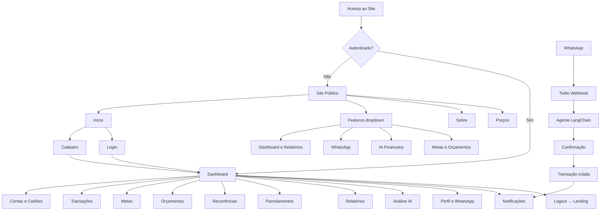

# PRD - Finova
## Product Requirement Document

---

## 1. Visão Geral

O **Finova** é um sistema de gestão de finanças pessoais desenvolvido em Python/Django, focado em simplicidade, eficiência e design sofisticado. O projeto visa fornecer uma solução completa para controle financeiro pessoal através de uma interface web moderna e elegante, com identidade visual minimalista em tema escuro — paleta preta + verde.

---

## 2. Sobre o Produto

Finova é uma aplicação web full-stack que permite aos usuários gerenciar suas finanças pessoais de forma intuitiva. O sistema utiliza Django como framework principal, com templates nativos para o frontend e TailwindCSS para estilização.

**Características principais:**
- Autenticação por email sem username
- Gestão de contas bancárias vinculadas aos 8 maiores bancos do Brasil
- Categorização de transações (padrão + personalizadas)
- Controle de receitas e despesas com débito automático de conta
- Transferências entre contas do mesmo usuário
- Cartões de crédito com controle de fatura e limite
- Metas financeiras com depósito vinculado à conta
- Orçamentos por categoria com alertas de estouro
- Recorrências — despesas e receitas fixas automáticas
- Parcelamentos — controle de compras parceladas
- Dashboard analítico com gráficos interativos (Chart.js)
- Relatórios financeiros detalhados por período
- Análise financeira com IA (LangChain + OpenAI)
- Integração com WhatsApp — registro por texto, áudio e foto
- Site público multi-página com páginas dedicadas por feature
- Design system consistente — paleta preta + verde, Inter, minimalismo

---

## 3. Propósito

Oferecer uma ferramenta completa, eficiente e visualmente sofisticada para que pessoas organizem suas finanças pessoais, acompanhem gastos em tempo real (inclusive via WhatsApp), gerenciem múltiplas contas e cartões, definam metas e orçamentos, e tomem decisões informadas através de dados claros e insights gerados por inteligência artificial.

---

## 4. Público Alvo

- **Primário:** Jovens adultos (25-40 anos) que buscam organizar suas finanças pessoais
- **Secundário:** Profissionais autônomos e freelancers que precisam controlar receitas e despesas
- **Terciário:** Famílias que desejam visibilidade sobre o orçamento doméstico

**Personas:**
- **Maria, 28 anos:** Designer freelancer — organiza recebimentos, acompanha metas de economia e registra gastos pelo WhatsApp em movimento
- **Carlos, 35 anos:** Profissional de TI — controla gastos mensais, gerencia múltiplas contas e cartões e acompanha orçamentos por categoria
- **Ana, 42 anos:** Mãe de família — gerencia orçamento doméstico, acompanha parcelamentos e quer relatórios claros no fim do mês

---

## 5. Objetivos

### Objetivos de Negócio
- Alcançar 100 usuários ativos no primeiro trimestre
- Taxa de retenção de 60% após 30 dias
- Diferencial competitivo: IA financeira + integração WhatsApp + design sofisticado

### Objetivos de Produto
- Interface intuitiva com curva de aprendizado inferior a 5 minutos
- Tempo de resposta inferior a 2 segundos para operações CRUD
- Sistema estável com 99% de uptime

### Objetivos de Usuário
- Visualizar saldo consolidado de todas as contas e cartões em tempo real
- Registrar gastos em segundos pelo WhatsApp sem abrir o app
- Categorizar transações de forma rápida com sugestão da IA
- Identificar padrões de gastos via relatórios e análise de IA
- Definir e acompanhar metas e orçamentos mensais
- Controlar parcelamentos e despesas fixas recorrentes

---

## 6. Requisitos Funcionais

### 6.1. Autenticação e Autorização
- **RF01:** Sistema deve permitir cadastro de novos usuários com email e senha
- **RF02:** Login deve ser realizado através de email (não username)
- **RF03:** Sistema deve validar formato de email e força de senha
- **RF04:** Logout deve redirecionar para landing page e encerrar sessão completamente
- **RF05:** Botão "Entrar" na landing page deve sempre exibir tela de login

### 6.2. Gestão de Perfil
- **RF06:** Usuário deve poder visualizar e editar dados do perfil (nome, telefone, nascimento)
- **RF07:** Usuário deve poder alterar senha
- **RF08:** Usuário deve poder vincular e verificar número de WhatsApp no perfil

### 6.3. Gestão de Contas Bancárias
- **RF09:** Usuário deve poder cadastrar múltiplas contas bancárias
- **RF10:** Cada conta deve ter: nome, tipo (corrente/poupança/carteira/investimento), banco vinculado, saldo inicial e flag de conta padrão
- **RF11:** Sistema deve calcular saldo atual baseado em transações via Django signals
- **RF12:** Apenas uma conta por usuário pode ser marcada como padrão por vez
- **RF13:** Os 8 maiores bancos do Brasil devem estar disponíveis com ícone SVG: Nubank, Itaú, Bradesco, Santander, Banco do Brasil, Caixa, Banco Inter, C6 Bank
- **RF14:** Extrato por conta deve incluir transações, transferências recebidas e enviadas

### 6.4. Gestão de Categorias
- **RF15:** Sistema deve fornecer categorias padrão (Alimentação, Transporte, Salário, etc.)
- **RF16:** Usuário deve poder criar categorias personalizadas com cor customizada
- **RF17:** Categorias devem ter tipo: receita ou despesa
- **RF18:** Sistema deve impedir exclusão de categorias em uso

### 6.5. Gestão de Transações
- **RF19:** Usuário deve poder registrar transações com valor, data, categoria, conta e descrição
- **RF20:** A conta padrão deve ser pré-selecionada no formulário de transação
- **RF21:** Transação pode ser vinculada a um cartão de crédito (não debita conta imediatamente)
- **RF22:** Sistema deve atualizar saldo da conta ao criar/editar/excluir transação via signals
- **RF23:** Sistema deve exibir alerta (não bloqueio) quando despesa deixaria conta com saldo negativo

### 6.6. Transferências entre Contas
- **RF24:** Usuário deve poder transferir valores entre suas próprias contas
- **RF25:** Transferência deve debitar conta de origem e creditar conta de destino com registro de transação nos dois lados
- **RF26:** Sistema deve alertar (não bloquear) quando saldo for insuficiente para transferência

### 6.7. Cartões de Crédito
- **RF27:** Usuário deve poder cadastrar múltiplos cartões com banco, limite, dia de fechamento e dia de vencimento
- **RF28:** Sistema deve calcular fatura atual, limite disponível e próxima data de vencimento
- **RF29:** Transações vinculadas ao cartão não debitam conta imediatamente — apenas ao pagar a fatura
- **RF30:** Usuário deve poder pagar a fatura do cartão debitando de uma conta corrente
- **RF31:** Histórico de faturas anteriores deve ser armazenado com status (aberta/fechada/paga)

### 6.8. Metas Financeiras
- **RF32:** Usuário deve poder criar metas com nome, valor alvo, prazo, cor e categoria opcional
- **RF33:** Usuário deve poder registrar depósitos em metas com débito automático da conta selecionada
- **RF34:** Sistema deve calcular progresso percentual e valor restante da meta
- **RF35:** Meta deve ser marcada como concluída automaticamente ao atingir valor alvo
- **RF36:** Dashboard deve exibir resumo das metas ativas com próximos prazos

### 6.9. Orçamentos por Categoria
- **RF37:** Usuário deve poder definir limite de gasto mensal por categoria de despesa
- **RF38:** Sistema deve calcular em tempo real quanto foi gasto e quanto resta do orçamento
- **RF39:** Barra de progresso deve mudar de cor: verde < 70%, amarelo 70–99%, vermelho >= 100%
- **RF40:** Sistema deve exibir alerta ao criar despesa que estoure o orçamento da categoria
- **RF41:** Dashboard deve exibir card com orçamentos críticos (>= 80% utilizados)
- **RF42:** Sidebar deve exibir badge vermelho com quantidade de orçamentos estourados

### 6.10. Recorrências
- **RF43:** Usuário deve poder cadastrar despesas e receitas recorrentes (aluguel, salário, assinaturas)
- **RF44:** Cada recorrência deve ter: nome, tipo, valor, categoria, conta, dia do mês e período de vigência
- **RF45:** Sistema deve lançar automaticamente transações das recorrências via management command idempotente
- **RF46:** Dashboard deve alertar quando houver recorrências pendentes de lançamento no mês atual

### 6.11. Parcelamentos
- **RF47:** Usuário deve poder registrar compras parceladas com valor total, número de parcelas, data inicial, categoria e conta
- **RF48:** Sistema deve gerar automaticamente todas as parcelas ao criar um plano via signal
- **RF49:** Usuário deve poder marcar parcelas individualmente como pagas — cria transação vinculada automaticamente
- **RF50:** Sistema deve exibir progresso do parcelamento com barra visual
- **RF51:** Dashboard deve exibir parcelas com vencimento no mês atual e valor total

### 6.12. Dashboard
- **RF52:** Dashboard deve exibir saldo total consolidado de todas as contas
- **RF53:** Dashboard deve exibir resumo mensal (receitas vs despesas vs saldo)
- **RF54:** Dashboard deve exibir gráfico de distribuição por categoria (donut Chart.js)
- **RF55:** Dashboard deve exibir gráfico de evolução mensal — últimos 6 meses (linhas Chart.js)
- **RF56:** Dashboard deve listar últimas transações
- **RF57:** Dashboard deve exibir resumo de metas, orçamentos críticos e parcelas do mês
- **RF58:** Dashboard deve permitir acesso rápido a: nova transação, nova conta, nova categoria, transferência

### 6.13. Relatórios
- **RF59:** Sistema deve gerar relatórios por período (mês atual, mês anterior, 3 meses, 6 meses, ano)
- **RF60:** Relatório deve exibir: total receitas, total despesas, saldo líquido, média diária, maior receita e maior despesa
- **RF61:** Relatório deve exibir distribuição por categoria com barra proporcional
- **RF62:** Relatório deve exibir gráfico de barras de evolução diária (Chart.js)
- **RF63:** Relatório deve exibir top 5 maiores despesas e top 5 maiores receitas do período
- **RF64:** Relatório deve exibir resumo por conta (saldo atual, entradas e saídas no período)
- **RF65:** Usuário deve poder filtrar relatório por conta específica

### 6.14. Análise Financeira com IA
- **RF66:** Sistema deve gerar análises financeiras personalizadas via agente LangChain + OpenAI
- **RF67:** Usuário deve poder solicitar nova análise pela interface (botão no dashboard)
- **RF68:** A última análise deve ser exibida no dashboard com resumo e link para modal completo
- **RF69:** Histórico de análises deve ser armazenado em banco de dados
- **RF70:** Sistema deve exibir mensagem amigável caso OPENAI_API_KEY não esteja configurada

### 6.15. Integração com WhatsApp
- **RF71:** Usuário deve poder vincular e verificar seu número de WhatsApp via código de 6 dígitos
- **RF72:** Sistema deve receber mensagens via webhook Twilio e processar com agente LangChain
- **RF73:** Usuário deve poder registrar transações por texto ("gastei 45 no almoço")
- **RF74:** Usuário deve poder registrar transações por áudio (transcrito via OpenAI Whisper)
- **RF75:** Usuário deve poder registrar transações por foto de comprovante (GPT-4o Vision)
- **RF76:** Agente deve pedir confirmação antes de lançar transação ("Confirma? sim/não")
- **RF77:** Usuário deve poder consultar saldo, gastos do mês e progresso de metas pelo WhatsApp
- **RF78:** Sistema deve enviar notificações proativas: transação criada, meta atingida, orçamento estourado
- **RF79:** Sistema deve enviar resumo financeiro semanal automático toda segunda-feira
- **RF80:** Plataforma deve ter central de notificações com ícone de sino no navbar e badge de não lidas

### 6.16. Site Público Multi-Página
- **RF81:** Site deve ter navbar global fixa com dropdown "Features" com 4 páginas dedicadas
- **RF82:** Landing page deve ter: hero, barra de bancos, proposta de valor, 4 blocos de features alternados, depoimentos e CTA final
- **RF83:** Cada feature principal deve ter página própria com hero, seções detalhadas e mocks HTML/CSS fiéis:
  - /features/dashboard/ — Dashboard e Relatórios
  - /features/whatsapp/ — Integração WhatsApp
  - /features/ia/ — IA Financeira
  - /features/metas/ — Metas e Orçamentos
- **RF84:** Site deve ter página /sobre/ com história, missão, valores e números do produto
- **RF85:** Site deve ter página /precos/ com dois planos, tabela comparativa e FAQ accordion
- **RF86:** Usuário autenticado deve ver navbar diferente (link para dashboard, sem CTAs de cadastro)
- **RF87:** Todas as páginas públicas devem ser responsivas e ter meta tags SEO únicas por página

---

## 7. Requisitos Não-Funcionais

### 7.1. Performance
- **RNF01:** Páginas devem carregar em menos de 2 segundos
- **RNF02:** Operações CRUD devem responder em menos de 1 segundo
- **RNF03:** Dashboard deve renderizar em menos de 3 segundos
- **RNF04:** Webhook do WhatsApp deve responder ao Twilio em menos de 500ms

### 7.2. Usabilidade
- **RNF05:** Interface deve ser intuitiva com curva de aprendizado inferior a 5 minutos
- **RNF06:** Sistema deve ser responsivo (mobile, tablet, desktop)
- **RNF07:** Feedback visual (toast notifications) para todas as ações do usuário
- **RNF08:** Mensagens de erro devem ser claras e em português

### 7.3. Design
- **RNF09:** Paleta oficial: fundo #0a0a0a, cards #111111, bordas #262626, primária #22c55e
- **RNF10:** Tipografia: Inter (Google Fonts) — weight 300 corpo, 600 títulos
- **RNF11:** Números financeiros em font-mono
- **RNF12:** Visual minimalista — sem poluição visual, muito espaço negativo
- **RNF13:** Hover states com transição de 150ms
- **RNF14:** Mocks de UI no site público em HTML/CSS puro — sem imagens externas

### 7.4. Segurança
- **RNF15:** Senhas armazenadas com hash seguro
- **RNF16:** Sessões expiram após inatividade
- **RNF17:** Proteção CSRF em todos os formulários
- **RNF18:** Verificação de ownership em todas as operações
- **RNF19:** Webhook WhatsApp deve validar assinatura Twilio
- **RNF20:** HTTPS obrigatório em produção

### 7.5. Manutenibilidade
- **RNF21:** Código deve seguir PEP 8 e usar aspas simples
- **RNF22:** Separação de responsabilidades por apps Django
- **RNF23:** Código em inglês, interface em português

### 7.6. Escalabilidade
- **RNF24:** Arquitetura deve suportar até 1000 usuários simultâneos
- **RNF25:** Banco de dados deve suportar milhões de transações com índices adequados

### 7.7. Compatibilidade
- **RNF26:** Suporte aos navegadores Chrome, Firefox, Safari, Edge (últimas 2 versões)
- **RNF27:** Compatível com dispositivos iOS e Android

---

## 8. Arquitetura Técnica

### 8.1. Stack Tecnológica

**Backend:**
- Python 3.11+
- Django 5.2+
- SQLite3 (desenvolvimento) / PostgreSQL (produção futura)
- LangChain 1.0+ e OpenAI (agente de IA, Whisper e Vision)
- Twilio (webhook e envio de mensagens WhatsApp)

**Frontend:**
- Django Template Language
- TailwindCSS 4.1+
- JavaScript ES6+ modular (um arquivo por feature)
- Chart.js (gráficos)
- Lucide Icons via CDN

**Infraestrutura:**
- Servidor de desenvolvimento Django
- ngrok (desenvolvimento do webhook WhatsApp)
- Docker (Sprint 21)
- Cron jobs: generate_recurrences (diário) e send_weekly_summaries (semanal)

### 8.2. Estrutura de Apps

```
finova/
├── core/          — configuração, dashboard, views públicas
├── users/         — autenticação email-based
├── profiles/      — perfil do usuário (1:1 com User)
├── accounts/      — contas bancárias, cartões, transferências
├── categories/    — categorias (padrão + personalizadas)
├── transactions/  — receitas e despesas
├── goals/         — metas financeiras
├── budgets/       — orçamentos por categoria
├── recurrences/   — despesas e receitas fixas recorrentes
├── installments/  — parcelamentos
├── reports/       — relatórios por período
├── ai/            — agente de IA, análise financeira
└── whatsapp/      — integração WhatsApp, notificações
```

### 8.3. Modelo de Dados

```
User (email-based)
  ├── Profile (1:1)
  ├── WhatsAppProfile (1:1)
  ├── Account (1:N) — bank_code + is_default
  ├── CreditCard (1:N)
  │     └── CardBill (1:N)
  ├── Category (1:N)
  ├── Transaction (1:N) — → Account ou CreditCard
  ├── Goal (1:N)
  ├── Budget (1:N) — por categoria/mês
  ├── Recurrence (1:N)
  ├── InstallmentPlan (1:N)
  │     └── Installment (1:N) — → Transaction
  ├── AIAnalysis (1:N)
  └── Notification (1:N)
```

### 8.4. Diagrama ER


```mermaid
erDiagram
    User ||--o| Profile : has
    User ||--o| WhatsAppProfile : links
    User ||--o{ Account : owns
    User ||--o{ CreditCard : owns
    User ||--o{ Category : creates
    User ||--o{ Transaction : records
    User ||--o{ Goal : sets
    User ||--o{ Budget : defines
    User ||--o{ Recurrence : schedules
    User ||--o{ InstallmentPlan : creates
    User ||--o{ AIAnalysis : receives
    User ||--o{ Notification : receives

    Account {
        int id PK
        int user_id FK
        string name
        string account_type
        string bank_code
        decimal initial_balance
        decimal current_balance
        bool is_default
        bool is_active
    }

    CreditCard {
        int id PK
        int user_id FK
        string name
        string bank_code
        decimal credit_limit
        int closing_day
        int due_day
        string color
        bool is_active
    }

    CardBill {
        int id PK
        int credit_card_id FK
        int payment_account_id FK
        date reference_month
        date closing_date
        date due_date
        decimal total_amount
        string status
        date payment_date
    }

    Transaction {
        int id PK
        int user_id FK
        int account_id FK
        int category_id FK
        int credit_card_id FK
        string transaction_type
        decimal amount
        date date
        text description
    }

    Goal {
        int id PK
        int user_id FK
        int category_id FK
        string name
        decimal target_amount
        decimal current_amount
        date deadline
        string color
        bool is_completed
    }

    Budget {
        int id PK
        int user_id FK
        int category_id FK
        decimal amount
        date month
    }

    Recurrence {
        int id PK
        int user_id FK
        int category_id FK
        int account_id FK
        string name
        string transaction_type
        decimal amount
        int day_of_month
        date start_date
        date end_date
        bool is_active
        date last_generated_date
    }

    InstallmentPlan {
        int id PK
        int user_id FK
        int category_id FK
        int account_id FK
        string name
        decimal total_amount
        int installment_count
        decimal installment_amount
        date start_date
    }

    Installment {
        int id PK
        int plan_id FK
        int transaction_id FK
        int number
        date due_date
        decimal amount
        string status
        date paid_date
    }

    AIAnalysis {
        int id PK
        int user_id FK
        text content
        string summary
        date period_start
        date period_end
        int tokens_used
        datetime created_at
    }

    WhatsAppProfile {
        int id PK
        int user_id FK
        string phone_number
        bool is_verified
        datetime verified_at
    }

    Notification {
        int id PK
        int user_id FK
        string title
        string message
        string notification_type
        bool is_read
        datetime created_at
    }
```

---

## 9. Design System

### 9.1. Paleta de Cores

| Token | Valor | Uso |
|-------|-------|-----|
| bg-primary | #0a0a0a | Fundo principal |
| bg-card | #111111 | Cards e superfícies |
| bg-elevated | #1a1a1a | Modais e dropdowns |
| border-subtle | #262626 | Bordas |
| accent | #22c55e | Primária verde |
| accent-hover | #16a34a | Verde no hover |
| accent-subtle | rgba(34,197,94,0.08) | Verde suave |
| text-primary | #f5f5f5 | Texto principal |
| text-secondary | #a3a3a3 | Texto secundário |
| text-tertiary | #525252 | Texto auxiliar |

### 9.2. Tipografia
- Fonte: **Inter** via Google Fonts
- Corpo: font-weight 300
- Títulos: font-weight 600
- Números financeiros: **font-mono**

### 9.3. Componentes Globais
- **Botões:** primary (verde sólido), secondary (outline verde), ghost
- **Cards:** fundo #111111, 1px border #262626
- **Inputs:** fundo #111, borda #262626, focus borda verde
- **Barras de progresso:** verde → amarelo → vermelho por threshold
- **Ícones:** Lucide Icons via CDN
- **Toast notifications:** posição fixed bottom-right, timeout automático

### 9.4. Bancos Suportados

| Código | Nome | Arquivo |
|--------|------|---------|
| nubank | Nubank | static/images/banks/nubank.svg |
| itau | Itaú | static/images/banks/itau.svg |
| bradesco | Bradesco | static/images/banks/bradesco.svg |
| santander | Santander | static/images/banks/santander.svg |
| bb | Banco do Brasil | static/images/banks/bb.svg |
| caixa | Caixa Econômica Federal | static/images/banks/caixa.svg |
| inter | Banco Inter | static/images/banks/inter.svg |
| c6 | C6 Bank | static/images/banks/c6.svg |
| other | Outro | ícone genérico |

---

## 10. Fluxo de UX


```mermaid
flowchart TD
    A[Acesso ao Site] --> B{Autenticado?}
    B -->|Não| C[Site Público]
    B -->|Sim| D[Dashboard]

    C --> C1[Início]
    C --> C2[Features dropdown]
    C --> C3[Sobre]
    C --> C4[Preços]
    C2 --> C2a[Dashboard e Relatórios]
    C2 --> C2b[WhatsApp]
    C2 --> C2c[IA Financeira]
    C2 --> C2d[Metas e Orçamentos]

    C1 --> E[Cadastro] --> D
    C1 --> F[Login] --> D

    D --> DA[Contas e Cartões]
    D --> DB[Transações]
    D --> DC[Metas]
    D --> DD[Orçamentos]
    D --> DE[Recorrências]
    D --> DF[Parcelamentos]
    D --> DG[Relatórios]
    D --> DH[Análise IA]
    D --> DI[Perfil e WhatsApp]
    D --> DJ[Notificações]
    D --> Logout[Logout → Landing]

    WA[WhatsApp] --> WB[Twilio Webhook]
    WB --> WC[Agente LangChain]
    WC --> WD[Confirmação]
    WD --> WE[Transação criada]
    WE --> DJ
```

---

## 11. Especificações de Features Complexas

### 11.1. Integração com WhatsApp

**Stack:** Twilio + LangChain + OpenAI (Whisper + GPT-4o Vision)

**Handlers:**
| Handler | Input | Processamento |
|---------|-------|---------------|
| TextMessageHandler | Texto livre | LangChain Agent |
| AudioMessageHandler | URL áudio | OpenAI Whisper → TextHandler |
| ImageMessageHandler | URL imagem | GPT-4o Vision → TextHandler |

**Notificações proativas:**
- Transação registrada na plataforma
- Orçamento de categoria estourado
- Meta atingida
- Resumo semanal (toda segunda-feira)
- Parcela vencendo em 3 dias

**Variáveis de ambiente:**
```env
TWILIO_ACCOUNT_SID=AC...
TWILIO_AUTH_TOKEN=...
TWILIO_WHATSAPP_NUMBER=whatsapp:+14155238886
```

### 11.2. Agente de IA Financeiro

**Stack:** LangChain 1.0+ + OpenAI gpt-4o-mini

**Tools do agente de análise:**
| Tool | Descrição |
|------|-----------|
| get_user_transactions | Transações do usuário no período |
| get_category_summary | Agregação por categoria |
| get_account_balances | Saldos das contas |
| get_monthly_comparison | Mês atual vs anterior |

**Tools adicionais do agente WhatsApp:**
| Tool | Descrição |
|------|-----------|
| create_transaction | Cria transação por linguagem natural |
| get_goal_progress | Progresso de metas |
| get_budget_status | Status dos orçamentos |
| get_monthly_summary | Resumo financeiro do mês |

**Variáveis de ambiente:**
```env
OPENAI_API_KEY=sk-...
AI_MODEL=gpt-4o-mini
AI_MAX_TOKENS=2048
AI_TEMPERATURE=0.3
```

### 11.3. Site Público — Páginas

| URL | Descrição |
|-----|-----------|
| / | Landing principal — hero, features, depoimentos, CTA |
| /features/dashboard/ | Dashboard e Relatórios |
| /features/whatsapp/ | Integração WhatsApp |
| /features/ia/ | IA Financeira |
| /features/metas/ | Metas e Orçamentos |
| /sobre/ | História, missão e valores |
| /precos/ | Planos Gratuito e Premium |

---

## 12. Riscos e Mitigações

| Risco | Probabilidade | Impacto | Mitigação |
|-------|--------------|---------|-----------|
| Complexidade crescente | Alta | Alto | Sprints curtas, anti-overengineering |
| Performance com volume de dados | Média | Médio | Paginação, índices, select_related |
| Segurança de dados financeiros | Baixa | Alto | HTTPS, CSRF, ownership checks |
| Custo da API OpenAI | Média | Médio | Análise sob demanda, max_tokens limitado |
| Confiabilidade do Twilio | Média | Alto | Tratamento gracioso de erros, fallback |
| Adoção de usuários | Média | Alto | Site público completo, WhatsApp como diferencial |

---

## 13. Roadmap de Sprints

| Sprint | Duração | Descrição | Status |
|--------|---------|-----------|--------|
| Sprint 0 | 1 semana | Setup e Configuração | ✅ Concluído |
| Sprint 1 | 1 semana | Autenticação e Usuários | ✅ Concluído |
| Sprint 2 | 1 semana | Landing Page | ✅ Concluído |
| Sprint 3 | 1 semana | Models de Contas e Categorias | ✅ Concluído |
| Sprint 4 | 1 semana | Views de Contas | ✅ Concluído |
| Sprint 5 | 1 semana | Views de Categorias | ✅ Concluído |
| Sprint 6 | 2 semanas | Transações | ✅ Concluído |
| Sprint 7 | 2 semanas | Dashboard e Gráficos | ✅ Concluído |
| Sprint 8 | 2 semanas | Agente de IA Financeiro | ✅ Concluído |
| Sprint 9 | 1 semana | Refinamentos e MVP | ✅ Concluído |
| Sprint 10 | 1 semana | Redesign Visual + Rebranding Finova | ✅ Concluído |
| Sprint 11 | 1 semana | App de Metas (Goals) | ✅ Concluído |
| Sprint 12 | 1 semana | App de Relatórios (Reports) | 🔄 Em andamento |
| Sprint 13 | 2 semanas | Vínculo Bancário e Transferências | ⏳ Planejado |
| Sprint 14 | 1 semana | Orçamentos por Categoria | ⏳ Planejado |
| Sprint 15 | 1 semana | Recorrências | ⏳ Planejado |
| Sprint 16 | 2 semanas | Parcelamentos | ⏳ Planejado |
| Sprint 17 | 2 semanas | Cartões de Crédito | ⏳ Planejado |
| Sprint 18 | 3 semanas | Integração com WhatsApp | ⏳ Planejado |
| Sprint 19 | 2 semanas | Reestruturação do Site Público | ⏳ Planejado |
| Sprint 20 | 2 semanas | Testes Automatizados | ⏳ Futuro |
| Sprint 21 | 1 semana | Containerização e CI/CD | ⏳ Futuro |
| **Total** | **~32 semanas** | **Produto completo** | |

---

## 14. Histórico de Versões

| Versão | Data | Mudanças |
|--------|------|----------|
| 1.0 | Janeiro 2026 | PRD inicial — MVP com auth, contas, categorias, transações, dashboard |
| 1.1 | Março 2026 | Agente de IA Financeiro (Sprint 8) |
| 2.0 | Abril 2026 | Redesign + Rebranding Finova + Metas + Relatórios + Vínculo Bancário + Transferências |
| 3.0 | Abril 2026 | Orçamentos + Recorrências + Parcelamentos + Cartões + WhatsApp + Site Público multi-página. Diagrama ER completo. RF expandidos para RF87. Roadmap 32 semanas. |

---

## 15. Conclusão

O **Finova** evoluiu de um MVP de controle financeiro para um produto completo que compete diretamente com as melhores soluções do mercado brasileiro. Com integração WhatsApp, IA financeira, cartões de crédito, parcelamentos, recorrências, orçamentos e um site público persuasivo, o Finova tem diferenciais claros e uma identidade visual sofisticada que o destaca da concorrência.

### Próximos Passos
1. Concluir Sprint 12 — Relatórios
2. Sprint 13 — Vínculo Bancário e Transferências
3. Sprints 14 a 17 — Orçamentos, Recorrências, Parcelamentos, Cartões
4. Sprint 18 — Integração WhatsApp (maior diferencial competitivo)
5. Sprint 19 — Site Público multi-página

### Princípios a Seguir
- **Simplicidade:** Anti-overengineering — cada feature entrega valor claro
- **Qualidade:** PEP 8, aspas simples, separação por apps Django
- **Consistência:** Design system rigoroso em todas as páginas
- **Segurança:** HTTPS, CSRF, ownership checks, validação Twilio
- **UX:** Do WhatsApp ao dashboard, a experiência é fluida e sem atrito

**Data de Criação:** Janeiro 2026
**Última Atualização:** Abril 2026
**Versão:** 3.0
**Status:** Em desenvolvimento ativo
