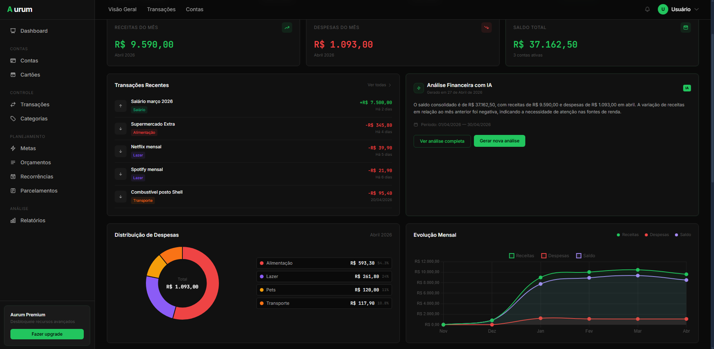
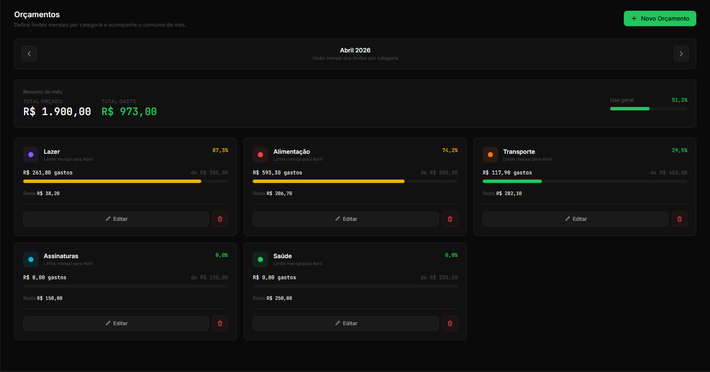
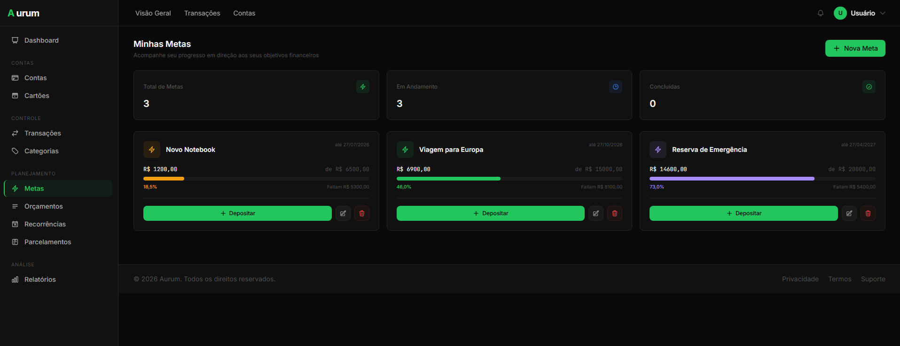
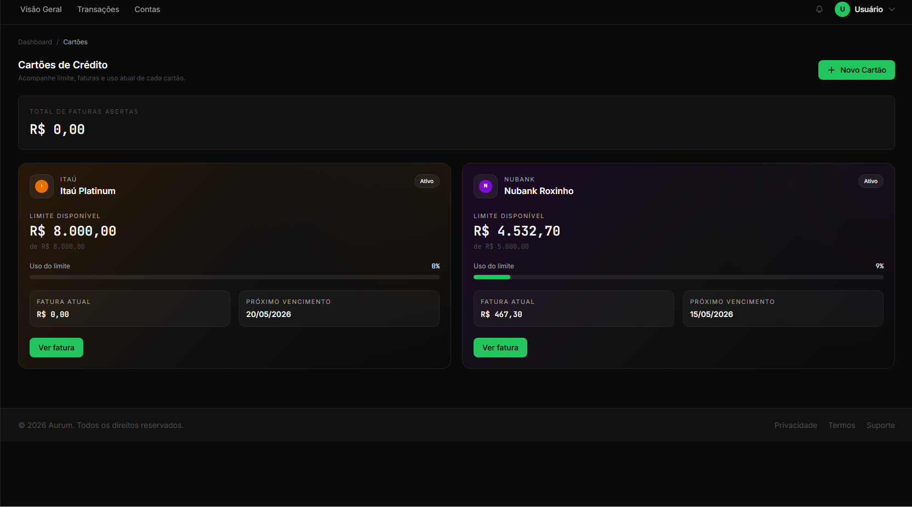
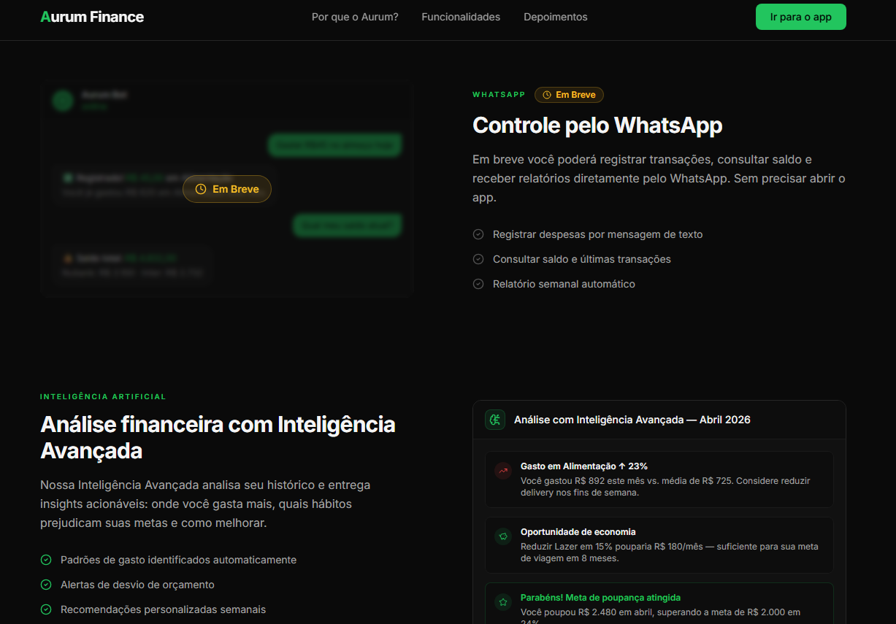

# Aurum Finance


<p align="right">
  <a href="README.md">🇺🇸 English</a>
</p>

Plataforma de gestão financeira pessoal construída com Django. Interface escura sofisticada, análise financeira com IA e integração com WhatsApp para registrar gastos sem esforço.

---

## Visão Geral

O Aurum Finance é uma aplicação web full-stack que oferece visibilidade e controle completos sobre as finanças pessoais do usuário. Além do rastreamento padrão de receitas e despesas, conta com um agente de IA que analisa padrões de gastos e entrega insights personalizados, além de uma integração com WhatsApp que permite registrar transações enviando uma mensagem de texto, áudio ou foto de um comprovante — sem precisar abrir o app.

<p align="center">
  
</p>

---

## Funcionalidades

### Gestão Financeira

- Suporte a múltiplas contas com integração para os 8 maiores bancos do Brasil
- Gerenciamento de cartões de crédito com controle de ciclo de faturamento, rastreamento de limite e pagamento de fatura
- Transações com débito automático em conta, alertas de saldo e vinculação a cartão de crédito
- Transferências entre contas com histórico completo de movimentações
- Parcelamentos com geração automática de cronograma de pagamento
- Lançamentos recorrentes, receitas e despesas fixas gerados automaticamente todo mês
- Metas financeiras com acompanhamento de progresso e depósitos vinculados a contas
- Orçamentos por categoria com monitoramento em tempo real e alertas de estouro

<p align="center">
  
  &nbsp;&nbsp;
  
</p>

### Inteligência & Análise

- Análise financeira com IA usando LangChain e OpenAI GPT-4o mini
- Insights e recomendações personalizadas de gastos entregues em português
- Integração com WhatsApp: registre transações por texto, mensagem de voz ou foto de comprovante
- Dashboard de evolução mensal com gráficos de linha interativos via Chart.js
- Relatórios detalhados filtráveis por período, conta e categoria
- Resumo financeiro semanal automático enviado pelo WhatsApp toda segunda-feira

<p align="center">
  
  &nbsp;&nbsp;
  
</p>

---

## Tech Stack

| Camada | Tecnologia |
|--------|-----------|
| Backend | Python 3.11, Django 5.2 |
| Frontend | TailwindCSS 4.1, JavaScript ES6+, Chart.js |
| IA | LangChain, OpenAI GPT-4o mini, Whisper API |
| WhatsApp | Twilio |
| Ícones | Lucide Icons |
| Banco de Dados | SQLite (desenvolvimento) / PostgreSQL (produção) |

---

## Como Começar

### Pré-requisitos

- Python 3.11+
- Node.js 18+
- Chave de API da OpenAI _(opcional — necessária para análise com IA e processamento de voz/imagem no WhatsApp)_
- Conta Twilio _(opcional — necessária para integração com WhatsApp)_

### Instalação

```bash
# Clone o repositório
git clone https://github.com/your-username/aurum-finance.git
cd aurum-finance

# Crie e ative o ambiente virtual
python -m venv venv
source venv/bin/activate  # Windows: venv\Scripts\activate

# Instale as dependências Python
pip install -r requirements.txt

# Instale as dependências Node e compile o CSS
npm install
npm run build:css

# Configure as variáveis de ambiente
cp .env.example .env
# Edite o .env com suas credenciais

# Execute as migrações
python manage.py migrate

# Crie as categorias padrão
python manage.py create_default_categories

# Popule dados de exemplo (opcional)
python manage.py seed_data

# Inicie o servidor de desenvolvimento
python manage.py runserver
```

---

## Roadmap

- [ ] Integração com WhatsApp — suporte a texto, voz e foto de comprovante
- [ ] Reestruturação do site público com páginas dedicadas por funcionalidade
- [ ] Suite de testes automatizados
- [ ] Setup com Docker e pipeline de CI/CD
